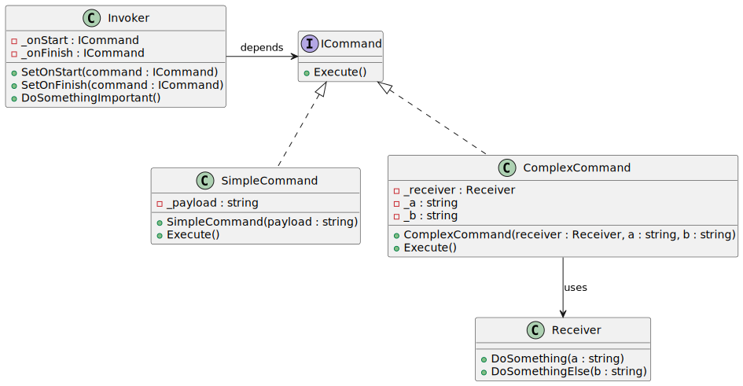

# Command 

| 項目      | 描述 |
| -------- | ------- |
| 名稱  |  |
| 意圖 |  |
| 問題/動機         |  |
| 解決方案      | | 
| 參與者和協作者 | Invoker 讓 Client 可以設定 Command, Receiver<br/> Invoker 負責傳送 request 給 Command  |  
| 效果         | | 
| 實作         |  | 

## 意圖

- 將請求(request)或簡單操作(simple operation)轉換為物件。
- 此物件會包含 request 的所有資訊
- 這種轉換允許命令的延遲執行或遠端執行，並支援儲存命令歷史記錄等功能。

## 使用時機/應用場合

### Parametrize objects with operations

- 使用命令模式（Command pattern）當您想要參數化物件與操作時。

- Command 可以將一個特定的方法呼叫轉換為一個獨立的物件。這種轉換開啟了許多有趣的應用場景：您可以將 command 作為方法的參數傳遞，將其儲存在其他物件中，或者在執行時切換所連結的命令等等。

- 以下是一個例子：您正在開發一個 GUI 元件，例如上下文選單，並希望使用者能夠配置選單項目，使其在最終使用者點擊項目時觸發操作。

### Queue operations, Schedule, Remotely execute

- 當您希望對操作進行排隊、安排執行或遠端執行時，可以使用 Command pattern。

- 與其他物件一樣，命令可以被序列化，這意味著可以將其轉換為一個字串，輕鬆地寫入檔案或資料庫。稍後，該字串可以恢復為初始的命令物件。這樣，您可以延遲和安排(schedule)命令的執行。不僅如此！以相同方式，您還可以對命令進行排隊、記錄或透過網路傳送。

### Reversible operations

- 當您想要實現可逆操作時，也可以使用命令模式。
- 儘管有許多方法可以實現撤銷/重做功能，但命令模式可能是最受歡迎的一種。
- 為了能夠恢復操作，您需要實現一個操作歷史記錄。命令歷史記錄是一個stack，包含所有已執行的命令物件以及應用程式狀態的相關備份。

#### 缺點

- 這種方法有兩個缺點。首先，儲存應用程式的狀態並不容易，因為其中一些可能是私有的。此問題可以使用備忘錄模式（Memento pattern）來緩解。

- 其次，狀態備份可能會佔用大量的 RAM。因此，有時您可以採用替代實現方式：與其恢復過去的狀態，不如讓命令執行反向操作(inverse operation)。反向操作也有代價：實現起來可能很困難，甚至是不可能的。

## 與其他模式的關係

### Command vs. 其他有 Senders/Receivers 的 pattern

- 處理連接請求的發送者和接收者的不同方式
- Chain of Responsibility: 將請求按順序傳遞給一個動態的潛在接收者鏈(potential receivers)，直到其中一個處理該請求為止。
- Command: 建立發送者和接收者之間的單向連接(unidirectional connections)。
- Mediator: 消除發送者和接收者之間的直接連接，強制它們透過中介者物件間接通信。  
- Observer: 允許接收者動態訂閱或取消訂閱接收請求。  

### Command vs. Chain of Responsibility

- 在Chain of Responsibility中，處理器(Handlers)可以實現為命令物件。在這種情況下，您可以針對表示request的同一上下文物件執行許多不同的操作(operations)。
- 然而，還有另一種方法，其中請求本身是一個命令物件。在這種情況下，您可以在鏈中的一系列不同上下文中執行相同的操作。

### Command vs. Memento

- 當實現 “undo” 功能時，您可以將命令模式與備忘錄模式(Memento)結合使用。在這種情況下，命令負責對目標物件執行各種操作，而備忘錄在命令執行之前保存該物件的狀態(state of that object)。

### Command vs. Strategy

- 命令模式與策略模式（Strategy）看起來相似，因為兩者都可以用來為物件參數化某些操作。然而，它們的意圖截然不同：

- **命令模式**：將任何操作轉換為一個物件，操作的參數變成該物件的fields。這種轉換允許您延遲執行操作、對操作排隊、儲存命令歷史記錄、將命令發送到遠端服務等。  
- **策略模式**：通常描述執行 __相同操作__ 的 __不同方法__，允許您在單一上下文類中交換這些演算法。  

### Command vs. Prototype

- 當需要將命令的副本保存到歷史記錄中時，可以使用原型模式(Prototype)。

### Command vs. Visitor

- 您可以將訪問者模式（Visitor）視為命令模式的強化版本。訪問者物件可以針對不同類別的各種物件執行操作。

## Code Example From Guru

- [source code links](https://refactoring.guru/design-patterns/command/csharp/example)

```csharp

// The Command interface declares a method for executing a command.
public interface ICommand
{
    void Execute();
}

// Some commands can implement simple operations on their own.
class SimpleCommand : ICommand
{
    private string _payload = string.Empty;

    public SimpleCommand(string payload)
    {
        this._payload = payload;
    }

    public void Execute()
    {
        Console.WriteLine($"SimpleCommand: See, I can do simple things like printing ({this._payload})");
    }
}

// However, some commands can delegate more complex operations to other
// objects, called "receivers."
class ComplexCommand : ICommand
{
    private Receiver _receiver;

    // Context data, required for launching the receiver's methods.
    private string _a;

    private string _b;

    // Complex commands can accept one or several receiver objects along
    // with any context data via the constructor.
    public ComplexCommand(Receiver receiver, string a, string b)
    {
        this._receiver = receiver;
        this._a = a;
        this._b = b;
    }

    // Commands can delegate to any methods of a receiver.
    public void Execute()
    {
        Console.WriteLine("ComplexCommand: Complex stuff should be done by a receiver object.");
        this._receiver.DoSomething(this._a);
        this._receiver.DoSomethingElse(this._b);
    }
}

// The Receiver classes contain some important business logic. They know how
// to perform all kinds of operations, associated with carrying out a
// request. In fact, any class may serve as a Receiver.
class Receiver
{
    public void DoSomething(string a)
    {
        Console.WriteLine($"Receiver: Working on ({a}.)");
    }

    public void DoSomethingElse(string b)
    {
        Console.WriteLine($"Receiver: Also working on ({b}.)");
    }
}

// The Invoker is associated with one or several commands. It sends a
// request to the command.
class Invoker
{
    private ICommand _onStart;

    private ICommand _onFinish;

    // Initialize commands.
    public void SetOnStart(ICommand command)
    {
        this._onStart = command;
    }

    public void SetOnFinish(ICommand command)
    {
        this._onFinish = command;
    }

    // The Invoker does not depend on concrete command or receiver classes.
    // The Invoker passes a request to a receiver indirectly, by executing a
    // command.
    public void DoSomethingImportant()
    {
        Console.WriteLine("Invoker: Does anybody want something done before I begin?");
        if (this._onStart is ICommand)
        {
            this._onStart.Execute();
        }
        
        Console.WriteLine("Invoker: ...doing something really important...");
        
        Console.WriteLine("Invoker: Does anybody want something done after I finish?");
        if (this._onFinish is ICommand)
        {
            this._onFinish.Execute();
        }
    }
}

class Program
{
    static void Main(string[] args)
    {
        // The client code can parameterize an invoker with any commands.
        Invoker invoker = new Invoker();
        invoker.SetOnStart(new SimpleCommand("Say Hi!"));
        Receiver receiver = new Receiver();
        invoker.SetOnFinish(new ComplexCommand(receiver, "Send email", "Save report"));

        invoker.DoSomethingImportant();
    }
}
```

### 成員介紹/說明

#### Sender/Invoker class

- Sender類別（又稱為Invoker）負責 __啟動(initiating)__ 請求。
- 該類別必須有一個欄位，用於儲存對 __命令物件(command object)__ 的引用。
- Sender 觸發該命令，而不是直接將請求發送給 Receiver。(command 內部去送給 receiver)
- 需要注意的是，Sender 並不負責創建命令物件。通常，它通過constructor從客戶端接收一個預先創建的command。

#### Command interface

- 命令介面通常只宣告一個方法，用於執行命令。

#### Concrete Commands class 

- 具體命令實現各種類型的請求。
- 具體命令並不需要自行執行工作，而是將調用傳遞給某個業務邏輯物件。然而，為了簡化程式碼，這些類別可以被合併。

- 執行接收物件(receiving object)方法所需的參數可以作為 concreate command 中的 field 宣告。
- 你可以通過僅允許通過建構函式初始化這些欄位，使命令物件成為不可變的。

#### Receiver class

- Receiver 類別包含一些業務邏輯。幾乎任何物件都可以作為接收者。
- 大多數命令僅處理如何將請求傳遞給接收者的細節，而實際的工作由接收者自己完成。

#### Client class 

- 客戶端負責 __創建並配置__ 具體命令物件。客戶端必須將所有請求參數(包括接收者實例)傳遞到 command 的constructor 中。之後，生成的命令可以與一個或多個發送者相關聯。

## UML 圖



```

@startuml
interface ICommand {
    + Execute()
}

class SimpleCommand {
    - _payload : string
    + SimpleCommand(payload : string)
    + Execute()
}

class ComplexCommand {
    - _receiver : Receiver
    - _a : string
    - _b : string
    + ComplexCommand(receiver : Receiver, a : string, b : string)
    + Execute()
}

class Receiver {
    + DoSomething(a : string)
    + DoSomethingElse(b : string)
}

class Invoker {
    - _onStart : ICommand
    - _onFinish : ICommand
    + SetOnStart(command : ICommand)
    + SetOnFinish(command : ICommand)
    + DoSomethingImportant()
}
ICommand <|.. SimpleCommand
ICommand <|.. ComplexCommand
ComplexCommand --> Receiver : uses
Invoker -right-> ICommand : depends
@enduml

```