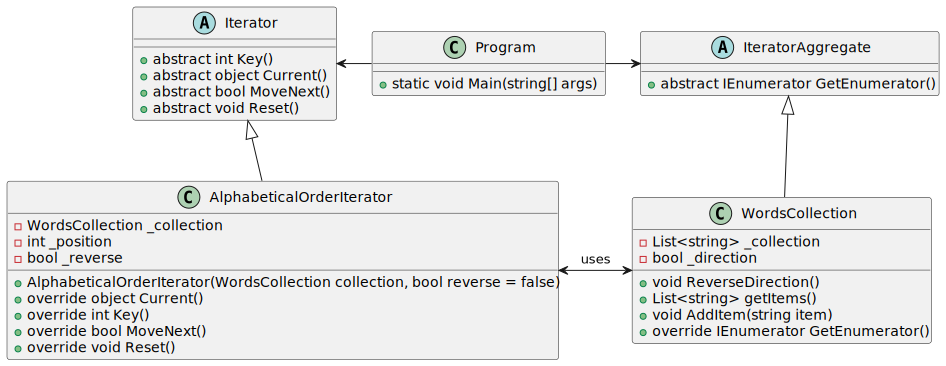

# Iterator

| 項目      | 描述 |
| -------- | ------- |
| 意圖 |  |
| 問題/動機         |  |
| 解決方案      | | 
| 參與者和協作者 |  |  
| 效果         | | 
| 實作         |  | 

## 意圖

- 迭代器是一種行為型設計模式，允許您在不暴露集合(如列表、堆疊、樹等)底層表示的情況下遍歷其元素。

## 使用時機/應用場合

### 隱藏複雜的資料結構

- 使用 Iterator Pattern 當您的集合底層具有複雜的資料結構，但您希望向客戶端隱藏其複雜性(無論是為了方便還是安全原因)。  

- 迭代器封裝了與複雜資料結構交互的細節，為客戶端提供了幾個簡單的方法來訪問集合中的元素。這種方法不僅對客戶端非常方便，還能保護集合免受客戶端可能直接操作集合時造成的粗心或惡意行為的影響。

### 減少重複的 traveral code

- 當您希望減少應用程式中遍歷代碼的重複時，可以使用該模式。

- 非簡單的迭代算法代碼通常相當冗長。如果將其放置於應用程式的業務邏輯中，可能會模糊原始代碼的責任並降低可維護性。將遍歷代碼移到專門的迭代器中可以幫助使應用程式代碼更加精簡和清晰。

### traverse 不同的資料結構

- 當您希望您的代碼能夠遍歷不同的資料結構，或者事先未知這些結構的類型時，可以使用迭代器模式。

- 該模式為集合和迭代器提供了一組通用介面。由於您的代碼現在使用這些介面，因此即使傳遞給它的是實現了這些介面的各種集合和迭代器，它也能正常運作。

## 與其他模式的關係

### Iterator vs. Composite

- 您可以使用迭代器(Iterator)來遍歷組合(Composite)樹結構。

### Iterator vs. Factory Method

- 您可以將工廠方法(actory Method)與迭代器一起使用，讓集合的子類別回傳與集合兼容的不同類型的迭代器。

### Iterator vs. Memento

- 您可以將備忘錄模式(Memento)與迭代器一起使用，以捕捉當前的迭代狀態，並在必要時復原(roll back)到該狀態。

### Iterator vs. Visitor

您可以將訪問者模式（Visitor）與迭代器一起使用，來遍歷複雜的資料結構，並對其元素執行某些操作，即使這些元素屬於不同的類別。

## Code Example From Guru

- [source code links](https://refactoring.guru/design-patterns/iterator/csharp/example)

```csharp

abstract class Iterator : IEnumerator
{
    object IEnumerator.Current => Current();

    // Returns the key of the current element
    public abstract int Key();
    
    // Returns the current element
    public abstract object Current();
    
    // Move forward to next element
    public abstract bool MoveNext();
    
    // Rewinds the Iterator to the first element
    public abstract void Reset();
}

abstract class IteratorAggregate : IEnumerable
{
    // Returns an Iterator or another IteratorAggregate for the implementing
    // object.
    public abstract IEnumerator GetEnumerator();
}

// Concrete Iterators implement various traversal algorithms. These classes
// store the current traversal position at all times.
class AlphabeticalOrderIterator : Iterator
{
    private WordsCollection _collection;
    
    // Stores the current traversal position. An iterator may have a lot of
    // other fields for storing iteration state, especially when it is
    // supposed to work with a particular kind of collection.
    private int _position = -1;
    
    private bool _reverse = false;

    public AlphabeticalOrderIterator(WordsCollection collection, bool reverse = false)
    {
        this._collection = collection;
        this._reverse = reverse;

        if (reverse)
        {
            this._position = collection.getItems().Count;
        }
    }
    
    public override object Current()
    {
        return this._collection.getItems()[_position];
    }

    public override int Key()
    {
        return this._position;
    }
    
    public override bool MoveNext()
    {
        int updatedPosition = this._position + (this._reverse ? -1 : 1);

        if (updatedPosition >= 0 && updatedPosition < this._collection.getItems().Count)
        {
            this._position = updatedPosition;
            return true;
        }
        else
        {
            return false;
        }
    }
    
    public override void Reset()
    {
        this._position = this._reverse ? this._collection.getItems().Count - 1 : 0;
    }
}

// Concrete Collections provide one or several methods for retrieving fresh
// iterator instances, compatible with the collection class.
class WordsCollection : IteratorAggregate
{
    List<string> _collection = new List<string>();
    
    bool _direction = false;
    
    public void ReverseDirection()
    {
        _direction = !_direction;
    }
    
    public List<string> getItems()
    {
        return _collection;
    }
    
    public void AddItem(string item)
    {
        this._collection.Add(item);
    }
    
    public override IEnumerator GetEnumerator()
    {
        return new AlphabeticalOrderIterator(this, _direction);
    }
}

class Program
{
    static void Main(string[] args)
    {
        // The client code may or may not know about the Concrete Iterator
        // or Collection classes, depending on the level of indirection you
        // want to keep in your program.
        var collection = new WordsCollection();
        collection.AddItem("First");
        collection.AddItem("Second");
        collection.AddItem("Third");

        Console.WriteLine("Straight traversal:");

        foreach (var element in collection)
        {
            Console.WriteLine(element);
        }

        Console.WriteLine("\nReverse traversal:");

        collection.ReverseDirection();

        foreach (var element in collection)
        {
            Console.WriteLine(element);
        }
    }
}

```

### 成員介紹/說明

### Iterator interface(迭代器介面)

- 宣告了遍歷集合所需的操作
- 例如獲取下一個元素、檢索當前位置、重新開始遍歷等。

### Concrete Iterators(具體迭代器)

- 實作了用於遍歷集合的特定算法。
- 迭代器對象應自行追蹤遍歷進度，這使得多個迭代器可以獨立地遍歷同一集合。

### Collection interface(集合介面)

- 宣告了一個或多個方法，用於獲取與集合兼容的迭代器。
- 注意，這些方法的回傳型別必須聲明為迭代器介面，以便具體集合可以返回各種類型的迭代器。

### Concrete Collections(具體集合)

- 每次client端請求迭代器時, 都會回傳特定具體迭代器類的新實例。
- 集合的其他代碼應該與集合定義在同一類中。只是這些細節與該設計模式本身無關，因此在此省略了。

### Client 

- 透過集合和迭代器的 interface 與它們交互。
- 這樣一來，客戶端不會與具體類別耦合，從而允許您使用相同的客戶端代碼來操作各種集合和迭代器。
- 通常，客戶端不會自行創建迭代器，而是從集合中獲取它們。然而，在某些情況下，客戶端可以直接創建迭代器，例如當客戶端需要定義自己的特殊迭代器時。

## UML 圖




```
@startuml

abstract class Iterator {
    + abstract int Key()
    + abstract object Current()
    + abstract bool MoveNext()
    + abstract void Reset()
}

abstract class IteratorAggregate {
    + abstract IEnumerator GetEnumerator()
}

class AlphabeticalOrderIterator {
    - WordsCollection _collection
    - int _position
    - bool _reverse
    + AlphabeticalOrderIterator(WordsCollection collection, bool reverse = false)
    + override object Current()
    + override int Key()
    + override bool MoveNext()
    + override void Reset()
}

class WordsCollection {
    - List<string> _collection
    - bool _direction
    + void ReverseDirection()
    + List<string> getItems()
    + void AddItem(string item)
    + override IEnumerator GetEnumerator()
}

class Program {
    + static void Main(string[] args)
}

Iterator <|-- AlphabeticalOrderIterator
IteratorAggregate <|-- WordsCollection
WordsCollection <-left-> AlphabeticalOrderIterator : uses

Program -left-> Iterator
Program -right-> IteratorAggregate
@enduml

```