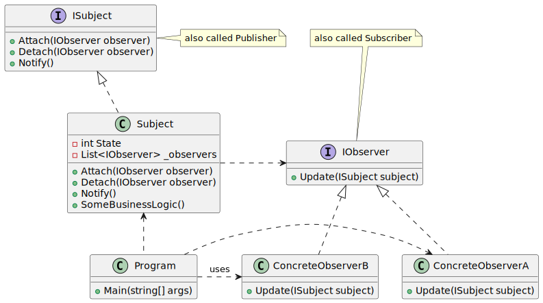

# Observer

| 項目      | 描述 |
| -------- | ------- |
| 意圖 | 在物件之間定義一種一對多的相依關係, 如此當一個物件的狀態改變時, 所有依者都將得到通知並自動更新。 |
| 問題/動機         | 當某個事件發生時, 需要向一系列變化著的物件發出通知。 |
| 解決方案      | Observer將監視某個事件的責任委託給中心物件: Subject。 | 
| 參與者和協作者 | Subject 知道自己的 Observer, 因為 Observer 要向它註冊。<br/> Subject 必須在所監視的事件發生時通知 Observer <br/> Observer 負責向 Subject 註冊, 以及在得到通知時從 Subject 處獲取資訊 |  
| 效果         | 如果某些 observer 只對事件的一個子集感興趣,那麼Subject可能會告訴它們不需要知道的事件. <br/> 如果Subject通知 Observer, Observer 還返回請求更多資訊, 則可能需要額外的通訊 | 
| 實作         |  讓某個事件發生時需要知道的物件(Observer) 將自己註冊到另一個監視事件發生或自己觸發事件的物件(Subject)上。 <br/> 事件發生時, Subject 告訴 Observer 事件已經發生。為了對所有 Observer 類型的物件實作 Observer介面, 有時候需要使用 Adapter 模式。 | 

## 意圖

- 定義物件間的一種一對多的相依關係, 當一個物件的狀態發生改變時, 所有相依於它的物件都將得到通知並自動更新

## 使用時機/應用場合

### 通知狀態改變

- 當一個對象的狀態變化可能需要改變其他對象的狀態，並且實際需要改變的對象集事先未知或會動態變化時，可以使用觀察者模式。

- 在處理圖形用戶界面類別時，你經常會遇到這樣的問題。例如，你創建了自定義的按鈕類，並希望讓客戶端將一些自定義代碼掛接到你的按鈕上，使得每當用戶按下按鈕時，這些代碼就會執行。

- 觀察者模式允許任何實現 subscriber interface (訂閱者接口)的對象訂閱發布者對象中的事件通知。

- 你可以將訂閱機制添加到按鈕中，讓客戶端通過自定義的訂閱者類掛接他們的自定義代碼。

### 需要觀察其他 objects

- 當應用中的某些對象需要觀察其他對象，但僅在有限的時間或特定情況下時，也可以使用這種模式。

- subscription list (訂閱列表)是動態的，因此訂閱者可以根據需要隨時加入或退出列表。

## 與其他模式的關係

### Observer vs. 其他有 Senders/Receivers 的 pattern

- [參考](../BehavioralPatterns/Command.md#command-vs-其他有-sendersreceivers-的-pattern)


### Observer vs. Mediator

- 中介者模式和觀察者模式之間的區別往往不太明顯(elusive)。
- 在大多數情況下，你可以實現其中任意一種模式；但有時，你可以同時應用這兩種模式。以下是如何做到這一點的說明。

- 中介者模式的主要目的是消除系統組件之間的相互依賴性(mutual dependencies)。取而代之的是，這些組件依賴於單一的中介者對象。
- 而觀察者模式的目標是建立對象之間的動態單向連接，其中一些對象充當其他對象的下屬。

- 有一種基於觀察者模式實現中介者模式的流行方法。中介者對象充當發布者，而組件則充當訂閱者，訂閱和取消訂閱中介者的事件。當以這種方式實現中介者模式時，它可能與觀察者模式非常相似。

- 當你感到困惑時，請記住，你可以用其他方式實現中介者模式。例如，你可以將所有組件永久地連接到同一個中介者對象。這種實現方式不會像觀察者模式，但仍然是中介者模式的一種實例。

- 現在，想像一個程序，其中所有組件都成為了發布者，允許彼此之間建立動態連接。這樣就不會有一個集中的中介者對象，而是形成了一個分佈式的觀察者集合。

## Code Example From Guru

- [source code links](https://refactoring.guru/design-patterns/observer/csharp/example)

```csharp
public interface IObserver
{
    // Receive update from subject
    void Update(ISubject subject);
}

public interface ISubject
{
    // Attach an observer to the subject.
    void Attach(IObserver observer);

    // Detach an observer from the subject.
    void Detach(IObserver observer);

    // Notify all observers about an event.
    void Notify();
}

// The Subject owns some important state and notifies observers when the
// state changes.
public class Subject : ISubject
{
    // For the sake of simplicity, the Subject's state, essential to all
    // subscribers, is stored in this variable.
    public int State { get; set; } = -0;

    // List of subscribers. In real life, the list of subscribers can be
    // stored more comprehensively (categorized by event type, etc.).
    private List<IObserver> _observers = new List<IObserver>();

    // The subscription management methods.
    public void Attach(IObserver observer)
    {
        Console.WriteLine("Subject: Attached an observer.");
        this._observers.Add(observer);
    }

    public void Detach(IObserver observer)
    {
        this._observers.Remove(observer);
        Console.WriteLine("Subject: Detached an observer.");
    }

    // Trigger an update in each subscriber.
    public void Notify()
    {
        Console.WriteLine("Subject: Notifying observers...");

        foreach (var observer in _observers)
        {
            observer.Update(this);
        }
    }

    // Usually, the subscription logic is only a fraction of what a Subject
    // can really do. Subjects commonly hold some important business logic,
    // that triggers a notification method whenever something important is
    // about to happen (or after it).
    public void SomeBusinessLogic()
    {
        Console.WriteLine("\nSubject: I'm doing something important.");
        this.State = new Random().Next(0, 10);

        Thread.Sleep(15);

        Console.WriteLine("Subject: My state has just changed to: " + this.State);
        this.Notify();
    }
}

// Concrete Observers react to the updates issued by the Subject they had
// been attached to.
class ConcreteObserverA : IObserver
{
    public void Update(ISubject subject)
    {            
        if ((subject as Subject).State < 3)
        {
            Console.WriteLine("ConcreteObserverA: Reacted to the event.");
        }
    }
}

class ConcreteObserverB : IObserver
{
    public void Update(ISubject subject)
    {
        if ((subject as Subject).State == 0 || (subject as Subject).State >= 2)
        {
            Console.WriteLine("ConcreteObserverB: Reacted to the event.");
        }
    }
}

class Program
{
    static void Main(string[] args)
    {
        // The client code.
        var subject = new Subject();
        var observerA = new ConcreteObserverA();
        subject.Attach(observerA);

        var observerB = new ConcreteObserverB();
        subject.Attach(observerB);

        subject.SomeBusinessLogic();
        subject.SomeBusinessLogic();

        subject.Detach(observerB);

        subject.SomeBusinessLogic();
    }
}
```

### 成員介紹/說明

#### Publisher 

- 發布者會向其他物件發出感興趣的事件。
- 這些事件通常在 publisher 改變其狀態或執行某些行為時發生。
- publisher 包含一個訂閱基礎設施，允許新的訂閱者加入以及現有的訂閱者從列表中移除。

#### 事件發生時 

- 當有新的事件發生時，發布者會遍歷訂閱列表，並對每個訂閱者對象調用在 subscriber interface (訂閱者接口)中宣告的通知方法。

#### Subscriber

- Subscriber interface 宣告了通知接口。
- 通常情況下，這個接口只包含一個 __update__ 方法。該方法可能包含多個參數，允許發布者在更新時傳遞一些事件細節。

#### Concrete Subscriber

- 具體的訂閱者會根據發布者發出的通知執行一些操作。
- 所有這些類別都必須實現相同的接口，以使得發布者不與具體的類別耦合。

#### Context of changes

- 通常, 訂閱者需要一些contextual information(上下文信息)來正確地處理更新。
- 因此，發布者經常將一些上下文數據作為通知方法的參數傳遞。
- 發布者也可以將自身作為參數傳遞，讓訂閱者能夠直接獲取所需的任何數據。
  - 這樣不會耦合太嚴重嗎?

#### Client 

- 客戶端會分別創建發布者和訂閱者對象，然後為發布者的更新註冊訂閱者。

## UML 圖



```
@startuml
interface IObserver {
    + Update(ISubject subject)
}

interface ISubject {
    + Attach(IObserver observer)
    + Detach(IObserver observer)
    + Notify()
}

class Subject implements ISubject {
    - int State
    - List<IObserver> _observers
    + Attach(IObserver observer)
    + Detach(IObserver observer)
    + Notify()
    + SomeBusinessLogic()
}

class ConcreteObserverA implements IObserver {
    + Update(ISubject subject)
}

class ConcreteObserverB implements IObserver {
    + Update(ISubject subject)
}

class Program {
    + Main(string[] args)
}

Subject .right.> IObserver
Program .up.> Subject 
Program .right.> ConcreteObserverA 
Program .right.> ConcreteObserverB : uses

note top of IObserver
also called Subscriber
end note

note left of ISubject
also called Publisher
end note


@enduml

```