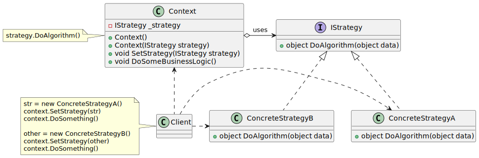

# Strategy


| 項目      | 描述 |
| -------- | ------- |
| 意圖 | 可以根據所處上下文, 使用不同的業務規則或演算法 |
| 問題 | 對所需演算法的選擇取決於發出請求的客戶或者要處理的資料。如果只有一些不會變化的演算法, 就不需要Strategy模式 |
| 解決方案 | 將對演算法的選擇和演算法的實作相分離。允許根據上下文進行選擇 |
| 參與者和協作者 | - Strategy指定了如何使用不同的演算法。<br/> - 各 ConcreteStrategy實作了這些不同的演算法。<br/> - Context 透過類型為Strategy的參照使用具體的ConcreteStrategy。<br/> - Strategy 與Context 相互作用以實作所選的演算法<br/> - (有時候Strategy必須查詢 Context)。或是Context將來自 Client的請求轉發給 Strategy |  
| 效果         | - Strategy模式定義了一系列的演算法。<br/> - 可以不使用switch語句或條件陳述式。<br/>  - 必須以相同的方式呼叫所有的演算法(它們必須擁有相同的介面)。各ConcreteStrategy 與Context之間的相互作用可能需要在Context 中加入獲取狀態的方法。 | 
| 實作         | - 讓使用演算法的類別(Context)包含一個抽象類別(Strategy),該抽象類別有一個抽象方法指定如何呼叫演算法。每個衍生類別依需要實作演算法 <br/> - 注意,在原型Strategy模式中,選擇所用具體實作的職責由Client物件承擔,並轉給 Strategy 模式的Context 物件。 | 

## 意圖

- 定義一系列的演算法, 把他們一個個封裝起來, 並且使它們可相互替換。
- Strategy 模式使演算法可獨立於使用它的客戶而變化


## 使用時機/應用場合

1. 使用 Strategy 當你希望在一個物件中使用不同的演算法變體，並且能夠在執行期間切換不同的演算法時。
2. 當你有許多相似的類別，但它們僅在執行某些行為的方式上有所不同時，使用策略模式。
3. 使用該模式來將類別的商務邏輯與演算法的實作細節隔離，因為這些細節可能在商務邏輯的上下文中並不那麼重要。
4. 當你的類別有一個巨大的條件判斷語句，根據不同的條件切換同一演算法的不同變體時，使用策略模式。


## 與其他模式的關係

### Strategy vs. Bridge,State,Adapter

- [參考](../StructuralPatterns/Adapter.md#adapter-vs-bridgestatestrategy)
  
### Strategy vs. Command

- Command 和 Strategy 可能看起來相似，因為你可以使用這兩種模式來參數化一個物件以執行某些操作。但它們的目的完全不同。
- Command 模式可以將任何 __操作__ 轉換為一個物件。操作的參數會成為該物件的欄位。這種轉換允許你延遲執行操作、將操作加入queue、儲存操作的歷史紀錄、將命令發送到遠端服務等。
- 而 Strategy 模式通常描述執行 __相同任務__ 的 __不同方法__，允許你在單一context類別中交換這些演算法。

### Strategy vs. Decorator

- Decorator 用於改變物件的「外觀」，而 Strategy 用於改變物件的「內部邏輯」。

### Strategy vs. Template Method

- Template Method 基於繼承：它允許通過在子類別中擴展部分來改變演算法的部分行為。
- 而 Strategy 則基於組合：你可以通過為物件提供不同的策略來改變物件的行為。
- Template Method 在類別層級工作，因此是靜態的。
- Strategy 在物件層級工作，允許你在執行期間切換行為。

### Strategy vs. State

- State 可以被視為 Strategy 的擴展。兩者都基於組合：它們透過將部分工作委託給輔助物件來改變context的行為。
- Strategy 模式讓這些物件完全獨立且彼此不知曉。
- 而 State 模式不限制具體狀態之間的相依性，允許它們隨意改變context的狀態。


## Code Example From Guru

- [source code links](https://refactoring.guru/design-patterns/strategy/csharp/example)

```csharp
// The Context defines the interface of interest to clients.
class Context
{
    // The Context maintains a reference to one of the Strategy objects. The
    // Context does not know the concrete class of a strategy. It should
    // work with all strategies via the Strategy interface.
    private IStrategy _strategy;

    public Context()
    { }

    // Usually, the Context accepts a strategy through the constructor, but
    // also provides a setter to change it at runtime.
    public Context(IStrategy strategy)
    {
        this._strategy = strategy;
    }

    // Usually, the Context allows replacing a Strategy object at runtime.
    public void SetStrategy(IStrategy strategy)
    {
        this._strategy = strategy;
    }

    // The Context delegates some work to the Strategy object instead of
    // implementing multiple versions of the algorithm on its own.
    public void DoSomeBusinessLogic()
    {
        Console.WriteLine("Context: Sorting data using the strategy (not sure how it'll do it)");
        var result = this._strategy.DoAlgorithm(new List<string> { "a", "b", "c", "d", "e" });

        string resultStr = string.Empty;
        foreach (var element in result as List<string>)
        {
            resultStr += element + ",";
        }

        Console.WriteLine(resultStr);
    }
}

// The Strategy interface declares operations common to all supported
// versions of some algorithm.
//
// The Context uses this interface to call the algorithm defined by Concrete
// Strategies.
public interface IStrategy
{
    object DoAlgorithm(object data);
}

// Concrete Strategies implement the algorithm while following the base
// Strategy interface. The interface makes them interchangeable in the
// Context.
class ConcreteStrategyA : IStrategy
{
    public object DoAlgorithm(object data)
    {
        var list = data as List<string>;
        list.Sort();

        return list;
    }
}

class ConcreteStrategyB : IStrategy
{
    public object DoAlgorithm(object data)
    {
        var list = data as List<string>;
        list.Sort();
        list.Reverse();

        return list;
    }
}

class Program
{
    static void Main(string[] args)
    {
        // The client code picks a concrete strategy and passes it to the
        // context. The client should be aware of the differences between
        // strategies in order to make the right choice.
        var context = new Context();

        Console.WriteLine("Client: Strategy is set to normal sorting.");
        context.SetStrategy(new ConcreteStrategyA());
        context.DoSomeBusinessLogic();
        
        Console.WriteLine();
        
        Console.WriteLine("Client: Strategy is set to reverse sorting.");
        context.SetStrategy(new ConcreteStrategyB());
        context.DoSomeBusinessLogic();
    }
}
```

## UML 圖



```
@startuml
    class Context {
        - IStrategy _strategy
        + Context()
        + Context(IStrategy strategy)
        + void SetStrategy(IStrategy strategy)
        + void DoSomeBusinessLogic()
    }

    interface IStrategy {
        + object DoAlgorithm(object data)
    }

    class ConcreteStrategyA {
        + object DoAlgorithm(object data)
    }

    class ConcreteStrategyB {
        + object DoAlgorithm(object data)
    }

    class Client{
    }

    Context o-right-> IStrategy : uses
    ConcreteStrategyA .up.|> IStrategy
    ConcreteStrategyB .up.|> IStrategy
    Client .right.> ConcreteStrategyA 
    Client .right.> ConcreteStrategyB
    Client .up.> Context

note left of Client
str = new ConcreteStrategyA()
context.SetStrategy(str)
context.DoSomething()

other = new ConcreteStrategyB()
context.SetStrategy(other)
context.DoSomething() 
end note

note left of Context
strategy.DoAlgorithm()
end note

@enduml
```
