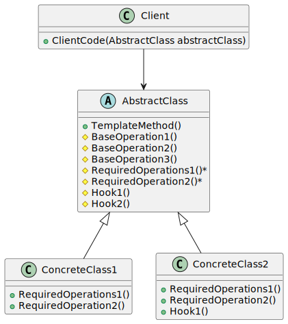

# Template Method

| 項目      | 描述 |
| -------- | ------- |
| 問題/動機         | 要完成在某一細節層次一致的一個過程或一系列步驟, 但其個別步驟在更詳細的層次上的實作可能不同。 |
| 解決方案      | 允許定義可變的子步驟, 同時保持基本過程一致。 | 
| 參與者和協作者 | Template Method 模式由一個抽象類別組成,這個抽象類別定義了需要覆蓋的基本 TemplateMethod 方法。<br/> 每個從這個抽象類別衍生的具體類別將為此範本實作新方法。|  
| 效果         | 範本提供了一個很好的程式碼再利用平台。它還有助於確保所需步驟的實作。<br/> 它將每個Concrete類別的覆蓋步驟綁定起來,因此只有在這些變化總是並且只能一起發生時, 才應該使用Template Method模式。 | 
| 實作         | 建立一個抽象類別, 用抽象方法實作一個過程。<br/> 這些抽象方法必須在子類別中實 作, 以執行過程的每個步驟。如果這些步驟是獨立變化的, 那麼每個步驟都可以用Strategy模式來實作。 | 

## 意圖

- 定義一個操作中演算法的骨架,將一些步驟推遲到子類別中實作。可以不改變演算法的結構而重定義該演算法的步驟。

## 使用時機/應用場合

### 擴展特定步驟, 但維持順序/結構

- 當您希望客戶端僅能擴展算法的某些特定步驟，而非整個演算法或其結構時，可以使用 Template Method。

- 模板方法可以將單一的算法轉換為 __一系列獨立的步驟__，這些步驟可以由子類輕鬆擴展，同時保持super class中定義的結構不變。

### 演算法雷同, 僅有小部分差異

- 當您有多個class包含幾乎相同的算法，但只有一些小差異時，可以使用該模式。因為如果算法發生變化，可能需要修改所有class。

- 將這樣的演算法轉換為模板方法後，您還可以將實現相似的步驟上移到super class中，消除代碼重複。而在子類間有差異的代碼可以保留在子類中。


## 與其他模式的關係

### Template Method vs. Factory Method

- 工廠方法是模板方法的一種 specialization (特殊化形式)。
- 同時，工廠方法也可以作為大型模板方法中的一個步驟。

### Template Method vs. Strategy

- 模板方法基於 __繼承__: 它允許您通過在子類中擴展演算法的某些部分來改變算法的一部分。
- 而策略模式基於 __組合__: 您可以通過為object提供對應於該行為的不同策略來改變object的某些behavior行為。
- 模板方法在class級別上運作, 因此是靜態的。
- 策略模式則在object級別上運作, 允許您在運行時切換行為。

## Code Example From Guru

- [source code links](https://refactoring.guru/design-patterns/template-method/csharp/example)

```csharp
// The Abstract Class defines a template method that contains a skeleton of
// some algorithm, composed of calls to (usually) abstract primitive
// operations.
//
// Concrete subclasses should implement these operations, but leave the
// template method itself intact.
abstract class AbstractClass
{
    // The template method defines the skeleton of an algorithm.
    public void TemplateMethod()
    {
        this.BaseOperation1();
        this.RequiredOperations1();
        this.BaseOperation2();
        this.Hook1();
        this.RequiredOperation2();
        this.BaseOperation3();
        this.Hook2();
    }

    // These operations already have implementations.
    protected void BaseOperation1()
    {
        Console.WriteLine("AbstractClass says: I am doing the bulk of the work");
    }

    protected void BaseOperation2()
    {
        Console.WriteLine("AbstractClass says: But I let subclasses override some operations");
    }

    protected void BaseOperation3()
    {
        Console.WriteLine("AbstractClass says: But I am doing the bulk of the work anyway");
    }
    
    // These operations have to be implemented in subclasses.
    protected abstract void RequiredOperations1();

    protected abstract void RequiredOperation2();
    
    // These are "hooks." Subclasses may override them, but it's not
    // mandatory since the hooks already have default (but empty)
    // implementation. Hooks provide additional extension points in some
    // crucial places of the algorithm.
    protected virtual void Hook1() { }

    protected virtual void Hook2() { }
}

// Concrete classes have to implement all abstract operations of the base
// class. They can also override some operations with a default
// implementation.
class ConcreteClass1 : AbstractClass
{
    protected override void RequiredOperations1()
    {
        Console.WriteLine("ConcreteClass1 says: Implemented Operation1");
    }

    protected override void RequiredOperation2()
    {
        Console.WriteLine("ConcreteClass1 says: Implemented Operation2");
    }
}

// Usually, concrete classes override only a fraction of base class'
// operations.
class ConcreteClass2 : AbstractClass
{
    protected override void RequiredOperations1()
    {
        Console.WriteLine("ConcreteClass2 says: Implemented Operation1");
    }

    protected override void RequiredOperation2()
    {
        Console.WriteLine("ConcreteClass2 says: Implemented Operation2");
    }

    protected override void Hook1()
    {
        Console.WriteLine("ConcreteClass2 says: Overridden Hook1");
    }
}

class Client
{
    // The client code calls the template method to execute the algorithm.
    // Client code does not have to know the concrete class of an object it
    // works with, as long as it works with objects through the interface of
    // their base class.
    public static void ClientCode(AbstractClass abstractClass)
    {
        // ...
        abstractClass.TemplateMethod();
        // ...
    }
}

class Program
{
    static void Main(string[] args)
    {
        Console.WriteLine("Same client code can work with different subclasses:");

        Client.ClientCode(new ConcreteClass1());

        Console.Write("\n");
        
        Console.WriteLine("Same client code can work with different subclasses:");
        Client.ClientCode(new ConcreteClass2());
    }
}
```

### 成員介紹/說明

#### Abstract Class

- 抽象類別宣告了作為演算法步驟的方法，以及實際的模板方法，該模板方法會以特定順序調用這些方法。
- 這些步驟可以被宣告為抽象方法，或者提供一些預設的實作。

#### Concrete Classes

- 具體類別可以覆寫所有的步驟，但無法覆寫 template method 本身。

## UML 圖



```
@startuml
abstract class AbstractClass {
    + TemplateMethod()
    # BaseOperation1()
    # BaseOperation2()
    # BaseOperation3()
    # RequiredOperations1()*
    # RequiredOperation2()*
    # Hook1()
    # Hook2()
}

class ConcreteClass1 {
    + RequiredOperations1()
    + RequiredOperation2()
}

class ConcreteClass2 {
    + RequiredOperations1()
    + RequiredOperation2()
    + Hook1()
}

class Client {
    + ClientCode(AbstractClass abstractClass)
}

AbstractClass <|-- ConcreteClass1
AbstractClass <|-- ConcreteClass2
Client --> AbstractClass

@enduml

```