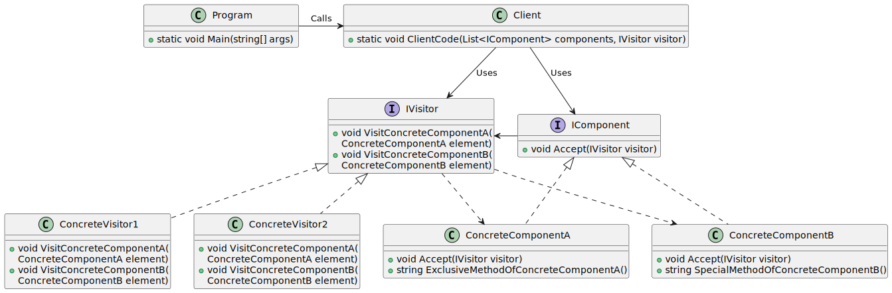

# Visitor

| 項目      | 描述 |
| -------- | ------- |
| 意圖 |  |
| 問題/動機         |  |
| 解決方案      | | 
| 參與者和協作者 |  |  
| 效果         | | 
| 實作         |  | 

## 意圖

- 允許你將演算法與其運行的物件分離。

## 使用時機/應用場合

### 對複雜的元素執行動作

- 當需要對複雜物件結構的所有元素執行某個操作(例如，物件樹)時，可以使用訪問者模式（Visitor）。  

- 訪問者模式允許你對一組具有不同類別的物件執行操作，方法是讓訪問者物件實作相同操作的多個變體，每個變體對應於所有目標類別。  

### 整理輔助行為 auxiliary behaviors

- 當需要清理 __輔助行為(auxiliary behaviors)的業務邏輯__ 時，可以使用訪問者模式。  

- 該模式可以將應用程式的主要類別專注於它們的核心職責，並將其他所有行為提取到一組訪問者類別中。  

### 行為只適用於 herarchy 中的某部份

- 當某個行為只適用於類別階層(class hierarchy)中的某些類別，而不適用於其他類別時，可以使用訪問者模式。  

- 你可以將這些行為提取到單獨的訪問者類別中，並且只實作那些接受相關類別物件的visiting method，對於無關的類別則保持方法為空。
 
## 與其他模式的關係

### Visitor vs. Command

- 你可以將訪問者模式(Visitor)視為命令模式(Command)的強化版本。訪問者物件可以對不同類別的各種物件執行操作。  

### Visitor vs. Composite

- 你可以使用訪問者模式來對整個 Composite 樹執行操作。  

### Visitor vs. Iterator

- 你可以將訪問者模式與迭代器模式(Iterator)結合使用，以遍歷複雜的資料結構，並對其元素執行某些操作，即使這些元素具有不同的類別。

## Code Example From Guru

- [source code links](https://refactoring.guru/design-patterns/visitor/csharp/example)

```csharp
// The Component interface declares an `accept` method that should take the
// base visitor interface as an argument.
public interface IComponent
{
    void Accept(IVisitor visitor);
}

// Each Concrete Component must implement the `Accept` method in such a way
// that it calls the visitor's method corresponding to the component's
// class.
public class ConcreteComponentA : IComponent
{
    // Note that we're calling `VisitConcreteComponentA`, which matches the
    // current class name. This way we let the visitor know the class of the
    // component it works with.
    public void Accept(IVisitor visitor)
    {
        visitor.VisitConcreteComponentA(this);
    }

    // Concrete Components may have special methods that don't exist in
    // their base class or interface. The Visitor is still able to use these
    // methods since it's aware of the component's concrete class.
    public string ExclusiveMethodOfConcreteComponentA()
    {
        return "A";
    }
}

public class ConcreteComponentB : IComponent
{
    // Same here: VisitConcreteComponentB => ConcreteComponentB
    public void Accept(IVisitor visitor)
    {
        visitor.VisitConcreteComponentB(this);
    }

    public string SpecialMethodOfConcreteComponentB()
    {
        return "B";
    }
}

// The Visitor Interface declares a set of visiting methods that correspond
// to component classes. The signature of a visiting method allows the
// visitor to identify the exact class of the component that it's dealing
// with.
public interface IVisitor
{
    void VisitConcreteComponentA(ConcreteComponentA element);

    void VisitConcreteComponentB(ConcreteComponentB element);
}

// Concrete Visitors implement several versions of the same algorithm, which
// can work with all concrete component classes.
//
// You can experience the biggest benefit of the Visitor pattern when using
// it with a complex object structure, such as a Composite tree. In this
// case, it might be helpful to store some intermediate state of the
// algorithm while executing visitor's methods over various objects of the
// structure.
class ConcreteVisitor1 : IVisitor
{
    public void VisitConcreteComponentA(ConcreteComponentA element)
    {
        Console.WriteLine(element.ExclusiveMethodOfConcreteComponentA() + " + ConcreteVisitor1");
    }

    public void VisitConcreteComponentB(ConcreteComponentB element)
    {
        Console.WriteLine(element.SpecialMethodOfConcreteComponentB() + " + ConcreteVisitor1");
    }
}

class ConcreteVisitor2 : IVisitor
{
    public void VisitConcreteComponentA(ConcreteComponentA element)
    {
        Console.WriteLine(element.ExclusiveMethodOfConcreteComponentA() + " + ConcreteVisitor2");
    }

    public void VisitConcreteComponentB(ConcreteComponentB element)
    {
        Console.WriteLine(element.SpecialMethodOfConcreteComponentB() + " + ConcreteVisitor2");
    }
}

public class Client
{
    // The client code can run visitor operations over any set of elements
    // without figuring out their concrete classes. The accept operation
    // directs a call to the appropriate operation in the visitor object.
    public static void ClientCode(List<IComponent> components, IVisitor visitor)
    {
        foreach (var component in components)
        {
            component.Accept(visitor);
        }
    }
}

class Program
{
    static void Main(string[] args)
    {
        List<IComponent> components = new List<IComponent>
        {
            new ConcreteComponentA(),
            new ConcreteComponentB()
        };

        Console.WriteLine("The client code works with all visitors via the base Visitor interface:");
        var visitor1 = new ConcreteVisitor1();
        Client.ClientCode(components,visitor1);

        Console.WriteLine();

        Console.WriteLine("It allows the same client code to work with different types of visitors:");
        var visitor2 = new ConcreteVisitor2();
        Client.ClientCode(components, visitor2);
    }
}
```

### 成員介紹/說明

#### Visitor Interface

- 宣告了一組訪問方法，這些方法可以將物件結構中的 __具體元素(concrete elements)__ 作為參數。
- 若程式語言支援 overloading，則這些方法可以具有相同的名稱，但它們的參數類型必須不同。  

#### Concrete Visitor

- 每個具體訪問者(Concrete Visitor)都實作了針對不同具體元素類別的行為變體，以適應不同的具體元素類型。  

#### Element Interface

- 元素介面(Element) 宣告了一個「接受」訪問者的方法，該方法應該有一個參數，其類型為訪問者介面。  

#### Concrete Element 

- 每個具體元素（Concrete Element）都必須實作接受方法。
- 此方法的目的是將呼叫重新定向到對應於當前元素類別的訪問者方法。
  - 呼叫的入口是在 concrete element, 但實際執行的地方變成是在 concrete visitor, 而非 concrete element 
- 需要注意的是，即使基礎元素類別 Element Interface 已經實作了該方法，所有子類別仍然需要在自己的類別中覆寫此方法，並調用訪問者物件上的適當方法。  

#### Client

- 客戶端通常表示一個集合或某種其他複雜物件(例如，Composite 樹)。
- 通常，客戶端並不了解所有的具體元素類別，因為它是透過某種抽象介面來操作這些集合中的物件。

## UML 圖



```
@startuml

interface IComponent {
    +void Accept(IVisitor visitor)
}

class ConcreteComponentA {
    +void Accept(IVisitor visitor)
    +string ExclusiveMethodOfConcreteComponentA()
}

class ConcreteComponentB {
    +void Accept(IVisitor visitor)
    +string SpecialMethodOfConcreteComponentB()
}

interface IVisitor {
    +void VisitConcreteComponentA(
        ConcreteComponentA element)
    +void VisitConcreteComponentB(
        ConcreteComponentB element)
}

class ConcreteVisitor1 {
    +void VisitConcreteComponentA(
        ConcreteComponentA element)
    +void VisitConcreteComponentB(
        ConcreteComponentB element)
}

class ConcreteVisitor2 {
    +void VisitConcreteComponentA(
        ConcreteComponentA element)
    +void VisitConcreteComponentB(
        ConcreteComponentB element)
}

class Client {
    +static void ClientCode(List<IComponent> components, IVisitor visitor)
}

class Program {
    +static void Main(string[] args)
}

IComponent <|.. ConcreteComponentA
IComponent <|.. ConcreteComponentB
IComponent -left-> IVisitor
IVisitor <|.. ConcreteVisitor1
IVisitor <|.. ConcreteVisitor2


IVisitor ..> ConcreteComponentA
IVisitor ..> ConcreteComponentB

Client --> IComponent : Uses
Client --> IVisitor : Uses

Program -right-> Client : Calls
@enduml

```