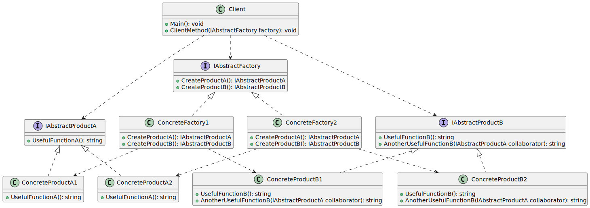

# Abstract Factory

| 項目      | 描述 |
| -------- | ------- |
| 意圖 | 需要為特定的客戶(或情況)提供物件組 |
| 問題/動機 | 需要實體化一組相關的物件 |
| 解決方案      | 協調物件組的建立。<br/> 提供一種方式, 將如何執行物件實體化的規則從使用這些物件的客戶物件提取出來。 | 
| 參與者和協作者 | AbstractFactory為如何建立物件組的每個成員定義介面。<br/> 一般每個組都由獨立的 ConcreteFactory 進行建立。 |  
| 效果         | 這個模式將「使用哪些物件」的規則與「如何使用這些物件」的邏輯分離開來。 | 
| 實作         | 定義一個抽象類別來指定建立哪些物件。<br/> 然後為每個組實作一個具體類別。可以用表或檔完成同樣的任務。| 


## 意圖

- 協調物件的實體化
- 為建立一組相關或相依的物件提供一個介面, 而且不需指定他們的具體類別
- produce families of related objects

## 使用時機/應用場合

- 在以下情況下使用 Abstract Factory 模式：
- 當您的程式碼需要處理多個相關產品家族，但您不希望它依賴於這些產品的具體類別時——可能因為具體類別事先未知，或者您希望未來可以方便地擴展。
- Abstract Factory 提供了一個用於創建每個產品家族類別的物件的介面。只要您的程式碼透過這個介面來創建物件，您就不必擔心會創建與應用程式已經使用的產品不匹配的產品變體。

- 當您有一個類別包含多個 Factory Methods，而這些方法模糊了類別的主要責任時，可以考慮實作 Abstract Factory。
- 在良好設計的程式中，每個類別應該只負責一件事。如果一個類別同時處理多種產品類型，可能值得將它的 Factory Methods 提取到一個獨立的factory class中，或者實現完整的 Abstract Factory 模式。

### 不同的實作方式

| 實作方式      | 說明 |
| -------- | ------- |
| 使用衍生類別 | 經典的Abstract Factory模式實作建議為需要的每組物件實作一個衍生類別。<br/> 這有些笨拙, 但也有其優點, 可以不改變任何已有類別而增加新類別。|
| 使用含有switch語句的一個物件 | 如果希望依需要修改 Abstract Factory 類別, 可以只讓一個物件包含所有這些規則。<br/> 儘管這並不遵循開閉原則, 但是它在一個地方包含了所有的規則, 不難維護|  
| 使用含有Switch語句的設定檔| 這比前一種方式更加靈活, 但有時仍然需要修改程式碼 | 
| 使用含有動態類別載入的設定檔 | 動態類別載入是一種根據字串中的物件名稱實體化物件的方法。<br/> 這種實作靈活性很強, 可以不修改任何程式碼增加新的類別和新的組合 | 

## 與其他模式的關係

### Abstract Factory vs. Factory Method, Prototype, Builder

- 許多設計一開始會使用 Factory Method(較簡單且透過子類別更容易自訂)，並逐漸演變為 Abstract Factory、Prototype 或 Builder（更靈活，但更複雜）。

#### Abstract Factory vs. Builder

- Builder 專注於一步步構建複雜的物件。
- Abstract Factory 則專精於建立相關物件的家族。
- Abstract Factory 會立即回傳產品，而 Builder 則允許在獲取產品之前執行一些額外的建構步驟。

#### Abstract Factory vs. Factory Method, Prototype

- Abstract Factory 類通常基於一組 Factory Methods，但你也可以使用 Prototype 來組合這些類別上的方法。

### Abstract Factory vs. Facade

- Abstract Factory 可以作為 Facade 的替代方案，當你只想隱藏子系統物件的創建方式以避免暴露給客戶端程式碼時，可以使用它。

### Abstract Factory vs. Bridge

- [參考](../StructuralPatterns/Bridge.md#bridge-vs-abstract-factory)

### Abstract Factory vs. Singletons

- Abstract Factories, Builders 和 Prototypes 都可以實作為 Singletons。


## Code Example From Guru

- [source code links](https://refactoring.guru/design-patterns/abstract-factory/csharp/example)

```csharp

// The Abstract Factory interface declares a set of methods that return
// different abstract products. These products are called a family and are
// related by a high-level theme or concept. Products of one family are
// usually able to collaborate among themselves. A family of products may
// have several variants, but the products of one variant are incompatible
// with products of another.
public interface IAbstractFactory
{
    IAbstractProductA CreateProductA();

    IAbstractProductB CreateProductB();
}

// Concrete Factories produce a family of products that belong to a single
// variant. The factory guarantees that resulting products are compatible.
// Note that signatures of the Concrete Factory's methods return an abstract
// product, while inside the method a concrete product is instantiated.
class ConcreteFactory1 : IAbstractFactory
{
    public IAbstractProductA CreateProductA()
    {
        return new ConcreteProductA1();
    }

    public IAbstractProductB CreateProductB()
    {
        return new ConcreteProductB1();
    }
}

// Each Concrete Factory has a corresponding product variant.
class ConcreteFactory2 : IAbstractFactory
{
    public IAbstractProductA CreateProductA()
    {
        return new ConcreteProductA2();
    }

    public IAbstractProductB CreateProductB()
    {
        return new ConcreteProductB2();
    }
}

// Each distinct product of a product family should have a base interface.
// All variants of the product must implement this interface.
public interface IAbstractProductA
{
    string UsefulFunctionA();
}

// Concrete Products are created by corresponding Concrete Factories.
class ConcreteProductA1 : IAbstractProductA
{
    public string UsefulFunctionA()
    {
        return "The result of the product A1.";
    }
}

class ConcreteProductA2 : IAbstractProductA
{
    public string UsefulFunctionA()
    {
        return "The result of the product A2.";
    }
}

// Here's the the base interface of another product. All products can
// interact with each other, but proper interaction is possible only between
// products of the same concrete variant.
public interface IAbstractProductB
{
    // Product B is able to do its own thing...
    string UsefulFunctionB();

    // ...but it also can collaborate with the ProductA.
    //
    // The Abstract Factory makes sure that all products it creates are of
    // the same variant and thus, compatible.
    string AnotherUsefulFunctionB(IAbstractProductA collaborator);
}

// Concrete Products are created by corresponding Concrete Factories.
class ConcreteProductB1 : IAbstractProductB
{
    public string UsefulFunctionB()
    {
        return "The result of the product B1.";
    }

    // The variant, Product B1, is only able to work correctly with the
    // variant, Product A1. Nevertheless, it accepts any instance of
    // AbstractProductA as an argument.
    public string AnotherUsefulFunctionB(IAbstractProductA collaborator)
    {
        var result = collaborator.UsefulFunctionA();

        return $"The result of the B1 collaborating with the ({result})";
    }
}

class ConcreteProductB2 : IAbstractProductB
{
    public string UsefulFunctionB()
    {
        return "The result of the product B2.";
    }

    // The variant, Product B2, is only able to work correctly with the
    // variant, Product A2. Nevertheless, it accepts any instance of
    // AbstractProductA as an argument.
    public string AnotherUsefulFunctionB(IAbstractProductA collaborator)
    {
        var result = collaborator.UsefulFunctionA();

        return $"The result of the B2 collaborating with the ({result})";
    }
}

// The client code works with factories and products only through abstract
// types: AbstractFactory and AbstractProduct. This lets you pass any
// factory or product subclass to the client code without breaking it.
class Client
{
    public void Main()
    {
        // The client code can work with any concrete factory class.
        Console.WriteLine("Client: Testing client code with the first factory type...");
        ClientMethod(new ConcreteFactory1());
        Console.WriteLine();

        Console.WriteLine("Client: Testing the same client code with the second factory type...");
        ClientMethod(new ConcreteFactory2());
    }

    public void ClientMethod(IAbstractFactory factory)
    {
        var productA = factory.CreateProductA();
        var productB = factory.CreateProductB();

        Console.WriteLine(productB.UsefulFunctionB());
        Console.WriteLine(productB.AnotherUsefulFunctionB(productA));
    }
}

class Program
{
    static void Main(string[] args)
    {
        new Client().Main();
    }
}
```

## UML 圖



```
@startuml
interface IAbstractFactory {
    + CreateProductA(): IAbstractProductA
    + CreateProductB(): IAbstractProductB
}

interface IAbstractProductA {
    + UsefulFunctionA(): string
}

interface IAbstractProductB {
    + UsefulFunctionB(): string
    + AnotherUsefulFunctionB(IAbstractProductA collaborator): string
}

class ConcreteFactory1 {
    + CreateProductA(): IAbstractProductA
    + CreateProductB(): IAbstractProductB
}

class ConcreteFactory2 {
    + CreateProductA(): IAbstractProductA
    + CreateProductB(): IAbstractProductB
}

class ConcreteProductA1 {
    + UsefulFunctionA(): string
}

class ConcreteProductA2 {
    + UsefulFunctionA(): string
}

class ConcreteProductB1 {
    + UsefulFunctionB(): string
    + AnotherUsefulFunctionB(IAbstractProductA collaborator): string
}

class ConcreteProductB2 {
    + UsefulFunctionB(): string
    + AnotherUsefulFunctionB(IAbstractProductA collaborator): string
}

class Client {
    + Main(): void
    + ClientMethod(IAbstractFactory factory): void
}

IAbstractFactory <|.. ConcreteFactory1
IAbstractFactory <|.. ConcreteFactory2

IAbstractProductA <|.. ConcreteProductA1
IAbstractProductA <|.. ConcreteProductA2

IAbstractProductB <|.. ConcreteProductB1
IAbstractProductB <|.. ConcreteProductB2

ConcreteFactory1 ..> ConcreteProductA1
ConcreteFactory1 ..> ConcreteProductB1

ConcreteFactory2 ..> ConcreteProductA2
ConcreteFactory2 ..> ConcreteProductB2

Client ..> IAbstractFactory
Client ..> IAbstractProductA
Client ..> IAbstractProductB
@enduml

```