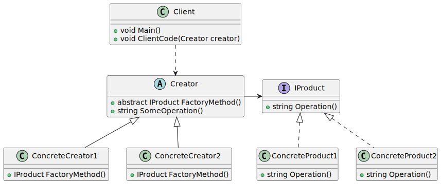

# Factory Method

| 項目      | 描述 |
| -------- | ------- |
| 問題/動機         | 一個類別需要實體化另一個類別的衍生類別, 但不知道是哪一個。<br/> actory Method 允許推遲到衍生類別進行決策。|
| 解決方案      | 衍生類別對實體化哪個類別和如何實體化做出決策。 | 
| 參與者和協作者 | Product 是工廠方法所建立的物件類型的介面。<br/> Creator 是定義工廠方法的介面。|  
| 效果         | 客戶將需要衍生Creator, 以建立一個特定的Concrete Product 物件。 | 
| 實作         | 在抽象類別中使用一個抽象方法(即C++的純虛函數)。<br/> 需要實體化一個被包含物件的時候抽象類別的程式碼將參照此方法, 但是不知道需要的物件是哪一個。 | 

## 意圖

- 為超類別提供了一個用於創建對象的介面，但允許子類別更改將要創建的對象類型。
- 定義一個用於建立物件的介面,讓子類別決定實體化哪一個類別。
- Factory Method使一個類別的實體化延遲到其子類別。

## 使用時機/應用場合

### 事先不知道確切類型

- 當你事先不知道程式碼應該使用的物件的確切類型及其相依性時，可以使用工廠方法(Factory Method)。  

- 工廠方法將產品建構的程式碼與實際使用產品的程式碼分離。因此，可以更輕鬆地獨立擴展產品建構程式碼，而不影響程式的其他部分。  

- 例如，若要向應用程式新增一種新的產品類型，只需要建立一個新的創建者(Creator)子類別，並在其中覆寫工廠方法即可。  

### 為函式庫提供擴展的彈性

- 當你想要為你的函式庫或框架的使用者提供擴展其內部組件的方法時，可以使用工廠方法。  

- 繼承可能是擴展函式庫或框架預設行為最簡單方式。但框架如何知道應該使用你的子類別，而不是標準元件呢？  

- 解決方案是將框架內部 __建構組件的程式碼__ 集中在一個單一的工廠方法中，並 __允許任何人覆寫__ 此方法，從而擴展組件本身。  

#### example

- 讓我們看看這是如何運作的。假設你正在使用一個開源 UI 框架來開發應用程式，而你的應用程式需要圓形按鈕(RoundButton)，但框架只提供了方形按鈕(SquareButton)。你可以擴展標準的 `Button` 類別，創建一個 `RoundButton` 子類別。但現在你需要告訴主框架 `UIFramework`，讓它使用新的 `RoundButton` 子類別，而不是預設的按鈕。  

- 為了實現這一點，你可以從基礎框架類別繼承，建立 `UIWithRoundButtons` 子類別，並覆寫其 `createButton` 方法。在基礎類別中，這個方法回傳的是 `Button` 物件，而你的子類別則會讓它回傳 `RoundButton` 物件。現在，你只需要使用 `UIWithRoundButtons` 類別，而不是 `UIFramework`，這樣就完成了！  

### 重復使用以節省系統資源

- 當你希望透過重複使用現有物件來節省系統資源，而不是每次都重新建立它們時，可以使用工廠方法。  

- 當處理大型、資源密集型物件(如資料庫連線、檔案系統和網路資源)時，通常會遇到這種需求。  

#### detail

- 如何重複使用現有物件：  
  1. 你需要建立某種儲存機制，以追蹤所有已建立的物件。  
  2. 當某個物件被請求時，程式應該在這個池(pool)中尋找一個可用的物件。  
  3. 如果找到可用物件，就將其回傳給客戶端程式碼。  
  4. 如果沒有可用物件，程式應該建立一個新的物件，並將其加入池中。  

- 這涉及大量程式碼，並且必須集中管理，避免程式中充滿重複的程式碼。  

- 最明顯且方便的地方是將這段程式碼放在類別的constructor中，因為我們要重複使用這個類別的物件。然而，建構函式的定義要求它必須回傳一個新的物件，無法回傳現有實例。  
- 因此，我們需要一個可以同時建立新物件並重複使用現有物件的普通方法(regular method)。這正是工廠方法的作用。

## 與其他模式的關係

### Factory Method vs. Abstract Factory, Prototype, Builder

- [參考](../CreationalPatterns/AbstractFactory.md#abstract-factory-vs-factory-method-prototype-builder)


#### Factory Method vs. Abstract Factory, Prototype

- [參考](../CreationalPatterns/AbstractFactory.md#abstract-factory-vs-factory-method-prototype)

### Factory Method vs. Iterator

- [參考](../BehavioralPatterns/Iterator.md#iterator-vs-factory-method)

### Factory Method vs. Prototype

- 原型模式並不是基於繼承，因此不會有繼承帶來的缺點。
- 然而，原型模式需要對複製的物件進行複雜的初始化。而工廠方法則是基於繼承，但不需要額外的初始化步驟。  

### Factory Method vs. Template Method

- [參考](../BehavioralPatterns/TemplateMethod.md#template-method-vs-factory-method)


## Code Example From Guru

- [source code links](https://refactoring.guru/design-patterns/factory-method/csharp/example)

```csharp
// The Creator class declares the factory method that is supposed to return
// an object of a Product class. The Creator's subclasses usually provide
// the implementation of this method.
abstract class Creator
{
    // Note that the Creator may also provide some default implementation of
    // the factory method.
    public abstract IProduct FactoryMethod();

    // Also note that, despite its name, the Creator's primary
    // responsibility is not creating products. Usually, it contains some
    // core business logic that relies on Product objects, returned by the
    // factory method. Subclasses can indirectly change that business logic
    // by overriding the factory method and returning a different type of
    // product from it.
    public string SomeOperation()
    {
        // Call the factory method to create a Product object.
        var product = FactoryMethod();
        // Now, use the product.
        var result = "Creator: The same creator's code has just worked with "
            + product.Operation();

        return result;
    }
}

// Concrete Creators override the factory method in order to change the
// resulting product's type.
class ConcreteCreator1 : Creator
{
    // Note that the signature of the method still uses the abstract product
    // type, even though the concrete product is actually returned from the
    // method. This way the Creator can stay independent of concrete product
    // classes.
    public override IProduct FactoryMethod()
    {
        return new ConcreteProduct1();
    }
}

class ConcreteCreator2 : Creator
{
    public override IProduct FactoryMethod()
    {
        return new ConcreteProduct2();
    }
}

// The Product interface declares the operations that all concrete products
// must implement.
public interface IProduct
{
    string Operation();
}

// Concrete Products provide various implementations of the Product
// interface.
class ConcreteProduct1 : IProduct
{
    public string Operation()
    {
        return "{Result of ConcreteProduct1}";
    }
}

class ConcreteProduct2 : IProduct
{
    public string Operation()
    {
        return "{Result of ConcreteProduct2}";
    }
}

class Client
{
    public void Main()
    {
        Console.WriteLine("App: Launched with the ConcreteCreator1.");
        ClientCode(new ConcreteCreator1());
        
        Console.WriteLine("");

        Console.WriteLine("App: Launched with the ConcreteCreator2.");
        ClientCode(new ConcreteCreator2());
    }

    // The client code works with an instance of a concrete creator, albeit
    // through its base interface. As long as the client keeps working with
    // the creator via the base interface, you can pass it any creator's
    // subclass.
    public void ClientCode(Creator creator)
    {
        // ...
        Console.WriteLine("Client: I'm not aware of the creator's class," +
            "but it still works.\n" + creator.SomeOperation());
        // ...
    }
}

```

### 成員介紹/說明

#### Product Interface

- 這個介面對所有可以由 Creater 及其子類別生產的對象都是通用的。  

#### Concrete Products

- 具體產品(Concrete Products)是產品介面的不同實作。  

#### Creator

- 創建者(Creator)類別宣告了一個工廠方法(factory method)，該方法會回傳新的產品物件。
- 重要的是，這個方法的回傳型別必須符合產品介面。  
- 你可以將 __工廠方法__ 宣告為抽象的，以強制所有子類別實作自己的方法版本。
- 作為替代方案，基礎工廠方法也可以回傳某種預設的產品類別。  

##### note

- 請注意，儘管名稱是「工廠方法」，但產品的創建並非創建者的主要職責。
- 通常，創建者類別已經具備一些 __與產品相關__ 的核心業務邏輯，而工廠方法的作用是幫助將這些邏輯與具體產品類別解耦。
- 這裡可以用一個類比來說明：一家大型軟體開發公司可能設有一個訓練部門來培訓程式設計師，但整個公司的主要職能仍然是撰寫程式碼，而不是培養程式設計師。  

#### Concrete Creators

- 具體創建者(Concrete Creators)會覆寫基礎工廠方法，使其回傳不同類型的產品。  
- 值得注意的是，工廠方法不一定每次都要創建新實例，它也可以從快取(cache)、物件池(object pool)或其他來源回傳現有的物件。

## UML 圖



```
@startuml
interface IProduct {
    + string Operation()
}

class ConcreteProduct1 {
    + string Operation()
}

class ConcreteProduct2 {
    + string Operation()
}

abstract class Creator {
    + abstract IProduct FactoryMethod()
    + string SomeOperation()
}

class ConcreteCreator1 {
    + IProduct FactoryMethod()
}

class ConcreteCreator2 {
    + IProduct FactoryMethod()
}

class Client {
    + void Main()
    + void ClientCode(Creator creator)
}


IProduct <|.. ConcreteProduct1
IProduct <|.. ConcreteProduct2

Creator <|-- ConcreteCreator1
Creator <|-- ConcreteCreator2

IProduct <-left- Creator

Client ..> Creator
@enduml

```