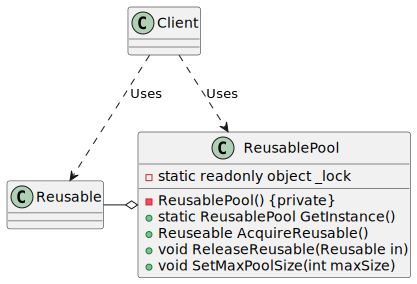

# Object Pool

| 項目      | 描述 |
| -------- | ------- |
| 問題/動機     |  物件的 __建立__ 和/或 __管理__ 必須遵循一組定義明確的規則集。通常這些規則都與如何。<br/> 建立物件、能夠建立多少個物件和在已有物件完成目前任務時如何再利用它們等等相關。 |
| 解決方案      | 在需要一個Reusable 物件時, Client 呼叫 ReusablePool的acquireReusable 方法。<br/> 如果池是空的, 那麼 acquireReusable 方法建立一個Reusable 物件(如果能夠), 否則,就等待直到有Reusable物件返回集合。 | 
| 參與者和協作者 | ReusablePool 管理著Client所用的Reusable物件的可用性。<br/> Client然後 在一個有限的時間段內使用Reusable物件的實體。 <br/> ReusablePool 包含所有 Reusable 物件, 如此就可以對其以統一的方式進行管理。 |  
| 效果         | 最適用於對物件的需求一直非常穩定的時候, 需求變化太大會帶來性能問題。<br/> Object Pool中為了解決這一問題, 限制了能夠建立的物件數量。使管理實體建立的邏輯與實體被管理的類別分離, 可以得到內聚更好的設計。 | 
| 實作         | 如果可以建立的物件數量有限制, 或者池的大小有限制,可以使用一個簡單的陣列來實作池。<br/> 否則,使用vector物件, 負責管理物件集區的物件必須是唯一能夠建立這些物件的物件。<br/> ReusablePool 是用Singleton模式實作的。另一種變體是在 Reusable 物件中加一個釋放方法 —— 讓它自己返回到池。 | 

## 意圖

- 在建立物件比較昂貴, 或者對於特定類型能夠建立的物件數目有限制時, 管理物件的再利用

## 使用時機/應用場合

## 與其他模式的關係

## Code Example From Guru

- [source code links]()

```csharp

```

### 成員介紹/說明


## UML 圖



```
@startuml

class ReusablePool {
    - ReusablePool() {private}
    - static readonly object _lock
    + static ReusablePool GetInstance()
    + Reuseable AcquireReusable()
    + void ReleaseReusable(Reusable in)
    + void SetMaxPoolSize(int maxSize)
}

class Client {
}

class Reusable {
}

ReusablePool <.up. Client : Uses
Reusable <.up. Client : Uses
ReusablePool o-left- Reusable

@enduml

```