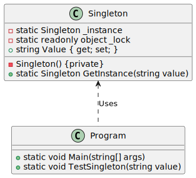

# Singleton

| 項目      | 描述 |
| -------- | ------- |
| 意圖 |希望物件只有一個實體, 但沒有控制物件實體化的全域物件。<br/> 還希望確保所有實體使用該物件相同的實體, 而無須將參照傳給它們。 |
| 問題/動機         | 幾個不同的客戶物件需要參照同一物件, 而且希望確保這種類型的物件數目不超過一個。 |
| 解決方案      | 保證一個實體。 | 
| 參與者和協作者 | Client 物件只能透過 getInstance 方法建立 Singleton 實體。 |  
| 效果         | Client 物件無須操心是否已存在Singleton實體。這是由Singleton自己控制的 | 
| 實作         | - 增加一個類別的私有的靜態成員變數, 參照所需的物件(初值為null)。<br/>  - 增加一個公共靜態方法. 它在成員變數的值為nu11時, 實體化這個類別(並設定成員變數的值), 然後回傳該成員變數的值<br/> - 將建構函數的狀態設定為保護或私有,而防止任何人直接實體化這個類別, 繞過靜態建構函數機制。 | 


## 意圖

- 保證一個類別僅有一個實體, 並提供一個存取它的全域存取點

## 使用時機/應用場合

### 類別只提供一個instance

- 當你在程式中需要讓某個類別只有一個實例且該實例可以被所有客戶端使用時，使用 Singleton 設計模式；例如，程式中不同部分共享的單一資料庫物件。

- Singleton 設計模式禁用所有其他創建該類別物件的方法，除了特別的創建方法。這個方法要麼創建一個新的物件，要麼如果已經存在，就返回現有的物件。

### 嚴格控制全域變數

- 當你需要對全域變數進行更嚴格的控制時，使用 Singleton 設計模式。

- 與全域變數不同，Singleton 設計模式保證類別只有一個實例。除了 Singleton 類別本身，沒有人能取代這個緩存的實例。

- 請注意，你可以調整這個限制，允許創建任意數量的 Singleton 實例。唯一需要更改的代碼是 __getInstance__ 方法的內容。     

## 與其他模式的關係

### Singleton vs. Facade

- 一個 Facade 類別通常可以轉換成 Singleton，因為在大多數情況下，一個單一的 Facade 物件就已經足夠。

### Singleton vs. Flyweight

- 如果你能將物件的所有共享狀態縮減為僅僅一個 Flyweight 物件，那麼 Flyweight 會類似於 Singleton。但是，這兩種模式之間存在兩個基本的區別：

- Singleton 必須只有一個實例，而 Flyweight 類別可以有多個具有不同內在狀態的實例。
- Singleton 物件可以是可變的，而 Flyweight 物件是不可變的。

### Singleton vs. Abstract Factories, Builders and Prototypes 

- 抽象工廠(Abstract Factories)、建造者 (Builders)和原型(Prototypes) 都可以實作為 Singleton。

## Code Example From Guru

- [source code links](https://refactoring.guru/design-patterns/singleton/csharp/example)

```csharp

// This Singleton implementation is called "double check lock". It is safe
// in multithreaded environment and provides lazy initialization for the
// Singleton object.
class Singleton
{
    private Singleton() { }

    private static Singleton _instance;

    // We now have a lock object that will be used to synchronize threads
    // during first access to the Singleton.
    private static readonly object _lock = new object();

    public static Singleton GetInstance(string value)
    {
        // This conditional is needed to prevent threads stumbling over the
        // lock once the instance is ready.
        if (_instance == null)
        {
            // Now, imagine that the program has just been launched. Since
            // there's no Singleton instance yet, multiple threads can
            // simultaneously pass the previous conditional and reach this
            // point almost at the same time. The first of them will acquire
            // lock and will proceed further, while the rest will wait here.
            lock (_lock)
            {
                // The first thread to acquire the lock, reaches this
                // conditional, goes inside and creates the Singleton
                // instance. Once it leaves the lock block, a thread that
                // might have been waiting for the lock release may then
                // enter this section. But since the Singleton field is
                // already initialized, the thread won't create a new
                // object.
                if (_instance == null)
                {
                    _instance = new Singleton();
                    _instance.Value = value;
                }
            }
        }
        return _instance;
    }

    // We'll use this property to prove that our Singleton really works.
    public string Value { get; set; }
}

class Program
{
    static void Main(string[] args)
    {
        // The client code.
        
        Console.WriteLine(
            "{0}\n{1}\n\n{2}\n",
            "If you see the same value, then singleton was reused (yay!)",
            "If you see different values, then 2 singletons were created (booo!!)",
            "RESULT:"
        );
        
        Thread process1 = new Thread(() =>
        {
            TestSingleton("FOO");
        });
        Thread process2 = new Thread(() =>
        {
            TestSingleton("BAR");
        });
        
        process1.Start();
        process2.Start();
        
        process1.Join();
        process2.Join();
    }
    
    public static void TestSingleton(string value)
    {
        Singleton singleton = Singleton.GetInstance(value);
        Console.WriteLine(singleton.Value);
    } 
}
```

### 成員介紹/說明

- Singleton 類別宣告了一個靜態方法 __getInstance__，該方法會回傳該類別的相同實例。

- Singleton 的建構函式應該對客戶端程式碼隱藏。呼叫 __getInstance__ 方法應該是獲取 Singleton 物件的唯一方式。

## UML 圖



```
@startuml

class Singleton {
    - Singleton() {private}
    - static Singleton _instance
    - static readonly object _lock
    + static Singleton GetInstance(string value)
    + string Value { get; set; }
}

class Program {
    + static void Main(string[] args)
    + static void TestSingleton(string value)
}

Singleton <.. Program : Uses

@enduml

```