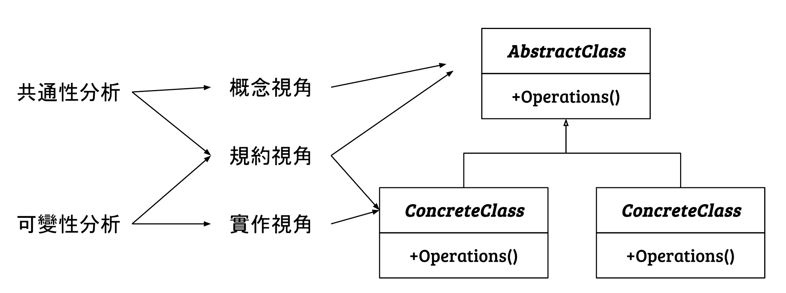

# 需求分析

## 策略

在進行設計以因應變化的過程中, 應該遵循兩條基本策略
1. 找出變化並封裝之
2. 優先使用物件聚合, 而不是類別繼承

## 共通性分析 vs. 可變性分析

### 共通性分析

1. 找到變化的地點
2. 尋找一些共同的要素, 幫助理解系列成員的共同之處在哪裡

### 可變性分析

1. 找出 __如何__ 變化
2. 系列成員之間的不同, 找到可能變化的結構

### 使用抽象類別進行特殊化的好處

| 與抽象類別的對應關係 | 描述 | 
|----|----|
| 抽象類別與核心概念 | 抽象類別代表了將所有衍生類別關聯起來的核心概念。  正是這個核心概念定義了衍生類別的共通性 |
| 共通性與要使用的抽象類別 | 共通性定義了需要使用的抽象類別 | 
| 可變性與抽象類別的衍生類別 | 在共通性中辨別出的可變性將成為抽象類別的衍生類別 |
| 規約與抽象類別的介面 |這些類別的介面對應於規約層次 |

### 設計的兩步法 

| 定義...時 | 必須問自己... | 
|----|----|
| 抽象類別(共通性) | 需要用什麼介面來處理這個類別的所有責任 | 
| 衍生類別(可變性) |「對於這個指定的特定實作(這個變化),應該怎樣根據指定的規約來實作它 |

- 共通
  - 規約視角和概念視角之間的關係在於: 規約標識了用來處理此所有情況(即概念視角所定義的共通性)所需的介面。
- 可變
  - 規約視角和實作視角之間的關係在於: 對於指定的規約,怎樣實作這個特定情況(這個變化)?

