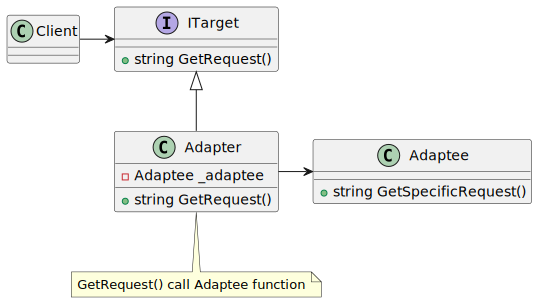

# Adapter

| 項目      | 描述 |
| -------- | ------- |
| 意圖 | 使控制範圍之外的一個原有物件與某個介面匹配 |
| 問題        | 系統的資料和行為都正確,但介面不符。通常用於必須從抽象類別衍生時 |
| 解決方案      | Adapter模式提供了具有所需介面的wrapper(包裝)類別 | 
| 參與者和協作者 | Adapter改變了 Adaptee的介面,使Adaptee與Adapter 的基礎類別 Target 匹配。<br/> 如此Client 就可以使用Adaptee了,好像它是Target類型 |  
| 效果         | Adapter模式使原有物件能夠適應新的類別結構,不受其介面的限制 | 
| 實作         | 將原有類別包含在另一個類別之中。讓包含類別與需要的介面匹配,呼叫被複合類別的方法。 | 

## 意圖

- 將一個類別的介面轉換為客戶希望的另外一個介面。
- Adapter 使原本由於介面不相容而不能一起工作的類別可以一起工作
- 建立新的介面

## 使用時機/應用場合

1. 當您想使用某個現有類別, 但其interface與現有程式碼不相容時, 可以使用適配器模式(Adapter pattern)。

2. 當您想重複使用一些現有的子類別，但這些子類別缺乏某些通用功能，而這些功能無法添加到超類別中時，也可以使用該模式。
    - 將缺失的功能放入一個adapter class中。然後可以將缺少功能的對象包裝在適配器中, 動態地獲得所需的功能。
    - 要實現這一點, 目標類別必須具有一個通用interface, 並且adapter的field應遵循該接口。這種方法與裝飾器模式(Decorator pattern)非常相似。

## 與其他模式的關係

### Adapter vs. Bridge

- 橋接模式（Bridge）通常是在開發初期就設計好的，讓應用程式的不同部分可以相互獨立開發。另一方面，Adapter 通常用於現有的應用程式，讓一些原本不相容的類別可以很好地一起工作。

### Adapter vs. Decorator

- Adapter 為存取現有對象(adaptee)提供了一個完全不同的interface。而在裝飾器模式(Decorator)中，interface 要麼保持不變，要麼被擴展。此外，裝飾器支持recursive composition，而Adapter則無法實現這一點。

### Adapter vs. Proxy

- 使用Adapter時，您通過不同的interface來存取現有object。使用代理模式(Proxy)時，interface保持不變。使用裝飾器時，您是通過增強接口來存取對象。

### Adapter vs. Facade

- 外觀模式(Facade)為現有 objects 定義了一個新interface，而適配器則試圖使現有的interface可用。適配器通常只包裝一個object，而外觀模式處理的是整個子系統的對象。
- Facade 簡化了介面, 而 Adapter 則將一個已有的介面轉換成另一個介面。

|       | Facade | Adapter |
| -------- | ------- | ------|
| 是否存在既有的類別?  |是 | 是 |
| 是否必須依某個介面設計? | 否 | 是 |
| 物件需要多型行為嗎? | 否 | 可能 | 
| 需要更簡單的介面嗎? | 是 | 否 |


### Adapter vs. Bridge,State,Strategy

- 橋接模式 Bridge、狀態模式 State、策略模式 Strategy 以及某種程度上的Adapter在結構上非常相似。事實上，這些模式都是基於組合的__composition__，也就是將工作委派給其他objects。
- 然而，它們解決的問題各不相同。一個設計模式不僅僅是一種用特定方式構建代碼的方案，它還能向其他開發者傳達該模式所解決的問題。

## Code Example From Guru

- [source code links](https://refactoring.guru/design-patterns/adapter/csharp/example)

```csharp
// The Target defines the domain-specific interface used by the client code.
public interface ITarget
{
    string GetRequest();
}

// The Adaptee contains some useful behavior, but its interface is
// incompatible with the existing client code. The Adaptee needs some
// adaptation before the client code can use it.
class Adaptee
{
    public string GetSpecificRequest()
    {
        return "Specific request.";
    }
}

// The Adapter makes the Adaptee's interface compatible with the Target's
// interface.
class Adapter : ITarget
{
    private readonly Adaptee _adaptee;

    public Adapter(Adaptee adaptee)
    {
        this._adaptee = adaptee;
    }

    public string GetRequest()
    {
        return $"This is '{this._adaptee.GetSpecificRequest()}'";
    }
}

class Program
{
    static void Main(string[] args)
    {
        Adaptee adaptee = new Adaptee();
        ITarget target = new Adapter(adaptee);

        Console.WriteLine("Adaptee interface is incompatible with the client.");
        Console.WriteLine("But with adapter client can call it's method.");

        Console.WriteLine(target.GetRequest());
    }
}
```

## UML 圖



```
@startuml
interface ITarget
{
+ string GetRequest()
}
class Adaptee
{
+ string GetSpecificRequest()
}
class Adapter
{
- Adaptee _adaptee
+ string GetRequest()
}
ITarget<|-- Adapter
Adapter -right-> Adaptee

class Client
Client -> ITarget

note bottom of Adapter
 GetRequest() call Adaptee function
end note

@enduml

```
