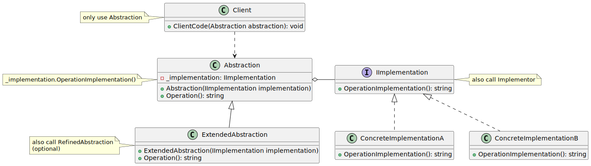

# Bridge

| 項目      | 描述 |
| -------- | ------- |
| 意圖 | 將一組實作與另一組使用它們的物件分離 |
| 問題/動機 | 一個抽象類別的衍生類別必須使用多個實作, 但不能出現類別數量爆炸性增長 |
| 解決方案      | 為所有實作定義一個介面, 供抽象類別的所有衍生類別使用 | 
| 參與者和協作者 | - Abstraction為要實作的物件定義介面 <br/> - Implementor為具體的實作類別定義介面。 <br/> - Abstraction的衍生類別使用 Implementor的衍生類別,卻無須知道自已具體使用哪一個 ConcreteImplementor<br/> |  
| 效果         | 實作與使用實作的物件解耦,提供了可擴展性,客戶物件無須操心實作問題。 | 
| 實作         | - 將實作封裝在一個抽象類別中 <br/> - 在要實作的抽象的基礎類別中包含一個實作的控制碼。 | 

## 意圖

- 將抽象與實作解耦合, 使它們都可以獨立地變化

## 使用時機/應用場合

- Bridge 由一個抽象(及其衍生)和一個實作組成
- 當需要拆分並組織一個擁有多種功能變體的 monolithic class 時(例如:類別需要支援不同的資料庫伺服器)。
- 當需要在多個正交(獨立)(orthogonal, independent)維度上擴展一個類別時，適合使用此模式。
  - Bridge 模式建議為每個維度提取出獨立的類別層級。
  - 原始類別將相關工作委派給這些類別，而非自行完成所有功能。
- 當需要在執行期切換實作時，也可以考慮使用 Bridge。
  - 許多人會將 Bridge 與 Strategy 混淆，因為它們都涉及以特定方式結構化類別。區別：一種模式不僅僅是組織類別的方式，還傳達了解決的問題以及設計的意圖。

## 與其他模式的關係

### Bridge vs. Adapter

- Bridge 通常在設計初期規劃，用於讓應用程式的不同部分可以彼此獨立開發。而 Adapter 則常用於現有的應用程式中，使一些原本不相容的類別能夠順利協作。

### Bridge vs. State,Strategy,Adapter

- Bridge、State、Strategy (以及某種程度上的 Adapter)有非常相似的結構。這些模式都基於組合，透過將工作委派給其他物件來實現。
- 然而，它們解決的問題各不相同。一個設計模式不僅是組織程式碼的一種方法，它還能向其他開發者傳達該模式所解決的問題。

### Bridge vs. Abstract Factory

- 你可以將 Abstract Factory 與 Bridge 一起使用。當 Bridge 定義的一些抽象僅能與特定的實作搭配使用時，這種組合非常有用。在這種情況下，Abstract Factory 可以封裝這些關係，並隱藏客戶端程式碼的複雜性。

### Bridge vs. Builder

- 你也可以將 Builder 與 Bridge 結合使用, Director class 扮演抽象的角色，而不同的 Builders class 則作為實作。


## Code Example From Guru

- [source code links](https://refactoring.guru/design-patterns/bridge/csharp/example)

```csharp

// The Abstraction defines the interface for the "control" part of the two
// class hierarchies. It maintains a reference to an object of the
// Implementation hierarchy and delegates all of the real work to this
// object.
class Abstraction
{
    protected IImplementation _implementation;
    
    public Abstraction(IImplementation implementation)
    {
        this._implementation = implementation;
    }
    
    public virtual string Operation()
    {
        return "Abstract: Base operation with:\n" + 
            _implementation.OperationImplementation();
    }
}

// You can extend the Abstraction without changing the Implementation
// classes.
class ExtendedAbstraction : Abstraction
{
    public ExtendedAbstraction(IImplementation implementation) : base(implementation)
    {
    }
    
    public override string Operation()
    {
        return "ExtendedAbstraction: Extended operation with:\n" +
            base._implementation.OperationImplementation();
    }
}

// The Implementation defines the interface for all implementation classes.
// It doesn't have to match the Abstraction's interface. In fact, the two
// interfaces can be entirely different. Typically the Implementation
// interface provides only primitive operations, while the Abstraction
// defines higher- level operations based on those primitives.
public interface IImplementation
{
    string OperationImplementation();
}

// Each Concrete Implementation corresponds to a specific platform and
// implements the Implementation interface using that platform's API.
class ConcreteImplementationA : IImplementation
{
    public string OperationImplementation()
    {
        return "ConcreteImplementationA: The result in platform A.\n";
    }
}

class ConcreteImplementationB : IImplementation
{
    public string OperationImplementation()
    {
        return "ConcreteImplementationB: The result in platform B.\n";
    }
}

class Client
{
    // Except for the initialization phase, where an Abstraction object gets
    // linked with a specific Implementation object, the client code should
    // only depend on the Abstraction class. This way the client code can
    // support any abstraction-implementation combination.
    public void ClientCode(Abstraction abstraction)
    {
        Console.Write(abstraction.Operation());
    }
}

class Program
{
    static void Main(string[] args)
    {
        Client client = new Client();

        Abstraction abstraction;
        // The client code should be able to work with any pre-configured
        // abstraction-implementation combination.
        abstraction = new Abstraction(new ConcreteImplementationA());
        client.ClientCode(abstraction);
        
        Console.WriteLine();
        
        abstraction = new ExtendedAbstraction(new ConcreteImplementationB());
        client.ClientCode(abstraction);
    }
}
```

## UML 圖



```
@startuml
interface IImplementation {
    + OperationImplementation(): string
}

class Abstraction {
    - _implementation: IImplementation
    + Abstraction(IImplementation implementation)
    + Operation(): string
}

class ExtendedAbstraction {
    + ExtendedAbstraction(IImplementation implementation)
    + Operation(): string
}

Abstraction <|-down- ExtendedAbstraction
Abstraction o-right- IImplementation

class ConcreteImplementationA {
    + OperationImplementation(): string
}

class ConcreteImplementationB {
    + OperationImplementation(): string
}

IImplementation <|.down. ConcreteImplementationA
IImplementation <|.down. ConcreteImplementationB

class Client {
    + ClientCode(Abstraction abstraction): void
}

Client ..> Abstraction

note left of Client 
only use Abstraction
end note

note right of IImplementation
also call Implementor
end note

note left of Abstraction
_implementation.OperationImplementation()
end note

note left of ExtendedAbstraction
also call RefinedAbstraction
(optional)
end note

@enduml
```


## UML 圖
