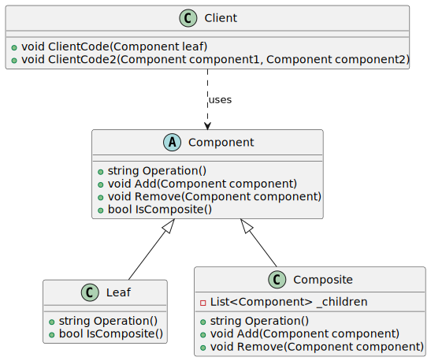

# Composite

| 項目      | 描述 |
| -------- | ------- |
| 名稱  |  |
| 意圖 |  |
| 問題/動機         |  |
| 解決方案      | | 
| 參與者和協作者 |  |  
| 效果         | | 
| 實作         |  | 
| 一般性結構    | |

## 意圖

## 使用時機/應用場合

- 使用 Composite 模式當你需要實現樹狀的物件結構時。  
- 當你希望 client 能統一處理簡單元素與複雜元素時，使用此模式。

## 與其他模式的關係

### Composite vs. Builder

- 當建立複雜的 Composite 樹時，可以使用 Builder，因為你可以將其 construction steps(建構步驟) 設計為遞迴執行。

### Composite vs. Chain of Responsibility

- Chain of Responsibility 常與 Composite 一起使用。在這種情況下，當某個 leaf component 收到請求時，它可以將請求透過所有父節點的chain向上傳遞，直到object tree的根節點。

### Composite vs. Iterator

- 可以使用 Iterator 來 traverse Composite tree。

### Composite vs. Visitor

- 可以使用 Visitor 來對整個 Composite 樹執行某種操作。

### Composite vs. Flyweight

- 可以將 Composite 樹的共享葉節點實作為 Flyweight，以節省記憶體空間。

### Composite vs. Decorator

- Composite 和 Decorator 的結構圖相似，因為兩者都依賴遞迴組合來組織一個開放數量(open-ended number)的物件。
- Decorator 類似於 Composite，但它只有一個子元件。另一個顯著的不同是：Decorator 為被包裝的物件 __添加__ 額外的職責，而 Composite 僅僅是「合計」其子節點的結果。
- 然而，這些模式也可以協作：可以使用 Decorator 來擴展 Composite 樹中特定物件的行為。

### Composite vs. Prototype

- 設計中若大量使用 Composite 和 Decorator，通常可以從 Prototype 中受益。應用該模式可讓你複製複雜的結構，而非從頭重新建構它們。


## Code Example From Guru

- [source code links](https://refactoring.guru/design-patterns/composite/csharp/example)

```csharp

// The base Component class declares common operations for both simple and
// complex objects of a composition.
abstract class Component
{
    public Component() { }

    // The base Component may implement some default behavior or leave it to
    // concrete classes (by declaring the method containing the behavior as
    // "abstract").
    public abstract string Operation();

    // In some cases, it would be beneficial to define the child-management
    // operations right in the base Component class. This way, you won't
    // need to expose any concrete component classes to the client code,
    // even during the object tree assembly. The downside is that these
    // methods will be empty for the leaf-level components.
    public virtual void Add(Component component)
    {
        throw new NotImplementedException();
    }

    public virtual void Remove(Component component)
    {
        throw new NotImplementedException();
    }

    // You can provide a method that lets the client code figure out whether
    // a component can bear children.
    public virtual bool IsComposite()
    {
        return true;
    }
}

// The Leaf class represents the end objects of a composition. A leaf can't
// have any children.
//
// Usually, it's the Leaf objects that do the actual work, whereas Composite
// objects only delegate to their sub-components.
class Leaf : Component
{
    public override string Operation()
    {
        return "Leaf";
    }

    public override bool IsComposite()
    {
        return false;
    }
}

// The Composite class represents the complex components that may have
// children. Usually, the Composite objects delegate the actual work to
// their children and then "sum-up" the result.
class Composite : Component
{
    protected List<Component> _children = new List<Component>();
    
    public override void Add(Component component)
    {
        this._children.Add(component);
    }

    public override void Remove(Component component)
    {
        this._children.Remove(component);
    }

    // The Composite executes its primary logic in a particular way. It
    // traverses recursively through all its children, collecting and
    // summing their results. Since the composite's children pass these
    // calls to their children and so forth, the whole object tree is
    // traversed as a result.
    public override string Operation()
    {
        int i = 0;
        string result = "Branch(";

        foreach (Component component in this._children)
        {
            result += component.Operation();
            if (i != this._children.Count - 1)
            {
                result += "+";
            }
            i++;
        }
        
        return result + ")";
    }
}

class Client
{
    // The client code works with all of the components via the base
    // interface.
    public void ClientCode(Component leaf)
    {
        Console.WriteLine($"RESULT: {leaf.Operation()}\n");
    }

    // Thanks to the fact that the child-management operations are declared
    // in the base Component class, the client code can work with any
    // component, simple or complex, without depending on their concrete
    // classes.
    public void ClientCode2(Component component1, Component component2)
    {
        if (component1.IsComposite())
        {
            component1.Add(component2);
        }
        
        Console.WriteLine($"RESULT: {component1.Operation()}");
    }
}

class Program
{
    static void Main(string[] args)
    {
        Client client = new Client();

        // This way the client code can support the simple leaf
        // components...
        Leaf leaf = new Leaf();
        Console.WriteLine("Client: I get a simple component:");
        client.ClientCode(leaf);

        // ...as well as the complex composites.
        Composite tree = new Composite();
        Composite branch1 = new Composite();
        branch1.Add(new Leaf());
        branch1.Add(new Leaf());
        Composite branch2 = new Composite();
        branch2.Add(new Leaf());
        tree.Add(branch1);
        tree.Add(branch2);
        Console.WriteLine("Client: Now I've got a composite tree:");
        client.ClientCode(tree);

        Console.Write("Client: I don't need to check the components classes even when managing the tree:\n");
        client.ClientCode2(tree, leaf);
    }
}
```

## UML 圖



```
@startuml
abstract class Component {
    + string Operation()
    + void Add(Component component)
    + void Remove(Component component)
    + bool IsComposite()
}

class Leaf {
    + string Operation()
    + bool IsComposite()
}

class Composite {
    - List<Component> _children
    + string Operation()
    + void Add(Component component)
    + void Remove(Component component)
}

class Client {
    + void ClientCode(Component leaf)
    + void ClientCode2(Component component1, Component component2)
}

Component <|-- Leaf
Component <|-- Composite

Client ..> Component : uses

@enduml

```