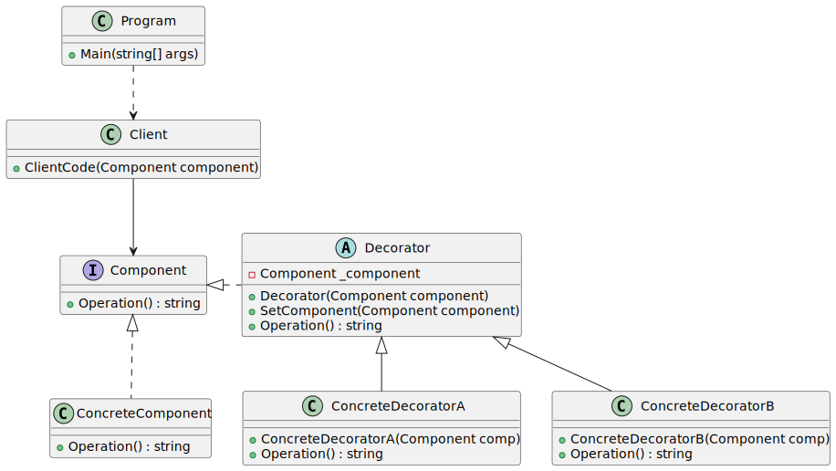

# Decorator

| 項目      | 描述 |
| -------- | ------- |
| 意圖 | 動態地給一個物件增加職責 |
| 問題/動機         | 要使用的物件將執行所需的基本功能。<br/> 但是,可能需要為這個物件將增加某些功能, 這些附加功能可能發生在物件的基礎功能之前或之後 |
| 解決方案      | 可以無須建立子類別, 而擴展一個物件的功能 | 
| 參與者和協作者 | ConcreteComponent 讓 Decorator 物件為自己增加功能。<br/> 有時候用 ConcreteComponent 的衍生類別提供核心功能, 在這種情況下 ConcreteComponent 類別就不再是具體的,而是抽象的。<br/> Component 類別定義了所有這些類別所使用的介面。 |  
| 效果         | 所增加的功能放在小物件中。好處是可以在 ConcreteComponent 物件的功能之前或之後動態增加功能。<br/> 注意,雖然裝飾物件可以在被裝飾對象之前或之後增加, 但物件鏈總是終於ConcreteComponent | 
| 實作         | 建立一個抽象類別來表示原類別和要增加到這個類別的新功能。在裝飾類別中, 將對新功能的呼叫放在對緊隨其後物件的呼叫之前或之後, 以獲得正確的順序 | 


## 意圖

- 裝飾者模式(Decorator)是一種structural設計模式，通過將物件置於包含行為的特殊wrapper object內，讓您能夠為物件附加新的行為。

## 使用時機/應用場合

- 當您需要在 __runtime__ 為物件動態分配額外的行為，而不破壞使用這些物件的程式碼時，可以使用裝飾者模式（Decorator）。
  - Decorator 讓您能夠將業務邏輯分層，為每一層創建一個裝飾者，並在執行期間以不同的組合來構造物件。
  - 由於所有這些物件都遵循共同的介面，客戶端程式碼可以用相同的方式處理它們。

- 當使用繼承來擴展物件行為變得笨拙或不可行時，可以考慮使用此模式。
  - 許多程式語言提供了 "final" 關鍵字，用於防止類別進一步擴展。
  - 對於一個被標記為 "final" 的類別，唯一能重複使用其現有行為的方法是使用Decorator，將該類別包裹在您自己的 wrapper class 中。

## 與其他模式的關係

### Decorator vs. Adapter

- 適配器(Adapter)為存取現有物件提供了一個 __完全不同__ 的介面，而裝飾者(Decorator)模式則讓介面保持不變或加以擴展。此外，裝飾者支援遞迴組合，而這在使用Adapter 時是無法實現的。

### Decorator vs Adapter, Proxy

- 使用 Adapter 時，透過不同的介面存取現有物件；
- 使用 代理(Proxy) 時，介面保持不變；
- 使用 Decorator 時，則透過增強的介面存取物件。

### Decorator vs. Chain of Responsibility

- 責任鏈(Chain of Responsibility, CoR)與裝飾者模式有非常相似的類別結構。兩種模式都依賴遞迴組合將執行傳遞給一系列物件。然而，兩者之間存在幾個重要的差異：

- CoR 的handlers可以獨立執行任意操作，並且可以在任何時候停止將請求向下傳遞。而裝飾者則在擴展物件行為的同時，保持與基礎介面的相容性。此外，裝飾者不允許中斷請求的傳遞流程。

### Decorator vs. Composite

- Composite(組合)與裝飾者在結構圖上也非常相似，因為兩者都依賴遞迴組合來組織一個開放數量的物件。

- 裝飾者類似於組合，但它只有一個子元件。另一個重要的差異是：裝飾者為被包裝的物件 __新增額外的責任__ ，而組合僅僅「合併」其子物件的結果。

- 然而，這兩種模式也可以合作：你可以使用裝飾者來擴展組合樹中特定物件的行為。

### Decorator vs. Prototype

- 在設計中大量使用組合和裝飾者時，通常可以從使用原型(Prototype)中受益。應用該模式可以clone複雜的結構，而不是從頭開始重新建構它們。

### Decorator vs. Strategy

- 裝飾者讓你改變物件的外觀，而策略模式(Strategy)則讓你改變其內部運作。

### Decorator vs. Proxy

- 裝飾者與代理模式在結構上相似，但意圖截然不同。兩者都基於組合原則，一個物件將部分工作委派給另一個物件。
- 區別在於，Proxy 通常自行管理其服務物件的生命週期，而裝飾者的組合則始終由客戶端控制。

## Code Example From Guru

- [source code links](https://refactoring.guru/design-patterns/decorator/csharp/example)


```csharp
// The base Component interface defines operations that can be altered by
// decorators.
public abstract class Component
{
    public abstract string Operation();
}

// Concrete Components provide default implementations of the operations.
// There might be several variations of these classes.
class ConcreteComponent : Component
{
    public override string Operation()
    {
        return "ConcreteComponent";
    }
}

// The base Decorator class follows the same interface as the other
// components. The primary purpose of this class is to define the wrapping
// interface for all concrete decorators. The default implementation of the
// wrapping code might include a field for storing a wrapped component and
// the means to initialize it.
abstract class Decorator : Component
{
    protected Component _component;

    public Decorator(Component component)
    {
        this._component = component;
    }

    public void SetComponent(Component component)
    {
        this._component = component;
    }

    // The Decorator delegates all work to the wrapped component.
    public override string Operation()
    {
        if (this._component != null)
        {
            return this._component.Operation();
        }
        else
        {
            return string.Empty;
        }
    }
}

// Concrete Decorators call the wrapped object and alter its result in some
// way.
class ConcreteDecoratorA : Decorator
{
    public ConcreteDecoratorA(Component comp) : base(comp)
    {
    }

    // Decorators may call parent implementation of the operation, instead
    // of calling the wrapped object directly. This approach simplifies
    // extension of decorator classes.
    public override string Operation()
    {
        return $"ConcreteDecoratorA({base.Operation()})";
    }
}

// Decorators can execute their behavior either before or after the call to
// a wrapped object.
class ConcreteDecoratorB : Decorator
{
    public ConcreteDecoratorB(Component comp) : base(comp)
    {
    }

    public override string Operation()
    {
        return $"ConcreteDecoratorB({base.Operation()})";
    }
}

public class Client
{
    // The client code works with all objects using the Component interface.
    // This way it can stay independent of the concrete classes of
    // components it works with.
    public void ClientCode(Component component)
    {
        Console.WriteLine("RESULT: " + component.Operation());
    }
}

class Program
{
    static void Main(string[] args)
    {
        Client client = new Client();

        var simple = new ConcreteComponent();
        Console.WriteLine("Client: I get a simple component:");
        client.ClientCode(simple);
        Console.WriteLine();

        // ...as well as decorated ones.
        //
        // Note how decorators can wrap not only simple components but the
        // other decorators as well.
        ConcreteDecoratorA decorator1 = new ConcreteDecoratorA(simple);
        ConcreteDecoratorB decorator2 = new ConcreteDecoratorB(decorator1);
        Console.WriteLine("Client: Now I've got a decorated component:");
        client.ClientCode(decorator2);
    }
}

```

### 成員介紹/說明

#### Component 

- 元件(Component)宣告了包裝器(wrapper)與被包裝物件(wrapped objects)共用的介面。

#### Concrete Component

- 具體元件(Concrete Component)是被包裝的物件類別。它定義了基本行為，而這些行為可以被裝飾者改變。

#### Base Decorator

- 基礎裝飾者類別(Base Decorator)包含一個用於參考被包裝物件的欄位。
- 該欄位的類型應宣告為元件介面，這樣它既可以包含具體元件，也可以包含裝飾者。
- 基礎裝飾者將所有操作委派給被包裝物件。

#### Concrete Decorators

- 具體裝飾者(Concrete Decorators)定義了可以動態新增到元件的額外行為。
- 具體裝飾者會覆寫基礎裝飾者的方法，並在執行其行為時選擇在呼叫父類別方法之前或之後執行。

#### Client 

- 客戶端(Client)可以將元件包裹在多層裝飾者中，只要它通過元件介面與所有物件互動即可。

## UML 圖



```
@startuml
interface Component {
    + Operation() : string
}

abstract class Decorator {
    - Component _component
    + Decorator(Component component)
    + SetComponent(Component component)
    + Operation() : string
}

class ConcreteComponent {
    + Operation() : string
}

class ConcreteDecoratorA {
    + ConcreteDecoratorA(Component comp)
    + Operation() : string
}

class ConcreteDecoratorB {
    + ConcreteDecoratorB(Component comp)
    + Operation() : string
}

class Client {
    + ClientCode(Component component)
}

class Program {
    + Main(string[] args)
}

Component <|.. ConcreteComponent
Component <|.right. Decorator
Decorator <|-- ConcreteDecoratorA
Decorator <|-- ConcreteDecoratorB

Client --> Component
Program ..> Client
@enduml

```