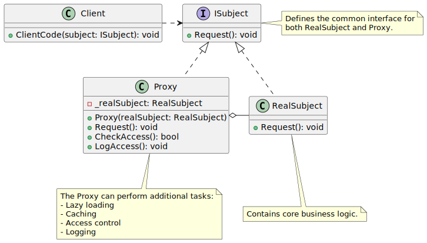

# Proxy

| 項目      | 描述 |
| -------- | ------- |
| 意圖 |  |
| 問題/動機         |  |
| 解決方案      | | 
| 參與者和協作者 |  |  
| 效果         | | 
| 實作         |  | 

## 意圖

- Proxy 是一種結構型設計模式，允許您為另一個物件提供替代或placeholder。
- 代理控制對原始物件的存取，讓您能夠在請求到達原始物件 __之前或之後__ 執行某些操作。

## 使用時機/應用場合

### Virtual Proxy (虛擬代, Lazy initialization)

- 當您有一個重量級的服務物件，即使僅偶爾需要使用，也一直處於啟動狀態，浪費了系統資源時，可以使用虛擬代理。  

- 與其在應用程式啟動時立即建立該物件，不如將物件的初始化延遲到實際需要使用的時候。  

### Protection Proxy (保護代理, Access control)

- 當您希望僅特定的客戶端能夠使用服務物件時，例如：您的物件是作業系統中的關鍵組件，而客戶端則是各種啟動的應用程式（包括惡意應用程式）。  

- proxy僅在客戶端的憑證符合某些標準時，才會將請求傳遞給服務物件。  


### Romote Proxy (遠端代理, Local execution of a remote service)

- 當服務物件(service object)位於遠端伺服器上時，可以使用遠端代理。  
- 在這種情況下，代理將客戶端的請求通過網路傳遞，並處理與網路相關的所有複雜細節。  

### Logging Proxy (日誌代理, Logging requests)

- 當您希望記錄服務物件(service object)的請求歷史(history of request)時，可以使用日誌代理。  

- 代理可以在將請求傳遞給服務物件之前，記錄每一個請求。  

### Caching Proxy (快取代理, Caching request results)

- 當您需要快取客戶端請求的結果並管理快取的生命週期，特別是當結果相當大時，可以使用快取代理。  

- 代理可以對重複的請求實現快取，這些請求始終產生相同的結果。代理可以使用請求的參數作為快取鍵(cache keys)。

### Smart Reference (智慧引用)

- 當您需要在沒有任何客戶端使用heavyweight object時，釋放該物件，可以使用智慧引用。  

- 代理可以追蹤哪些客戶端有獲取服務物件或其結果。
- 代理可以不時檢查這些客戶端是否仍然活躍。如果客戶端清單變為空，代理可能會銷毀服務物件並釋放相關的系統資源。  
- 代理還可以追蹤客戶端是否修改過服務物件。如果物件未被修改，則可以重複利用給其他客戶端使用。
    

## 與其他模式的關係

### Proxy vs. Adapter, Decorator

- 使用 Adapter 時，您透過不同的介面存取現有的物件
- 而使用 Proxy 時，介面保持不變。
- 使用 Decorator 時，則是透過增強的介面存取物件。

### Proxy vs. Facade

- Facade 與 Proxy 類似，兩者都用於緩衝複雜的實體並能自行初始化。
- 然而，不同於 Facade，Proxy 與其服務物件具有__相同的介面__，因此它們可以互相替換。

### Proxy vs. Decorator 

- Decorator 和 Proxy 的結構相似，但目的完全不同。這兩種模式都基於組合原則(composition principle)，其中一個物件會將部分工作委派給另一個物件。
- 不同之處在於，Proxy 通常會自行管理其服務物件的生命週期，而 Decorator 的組合則始終由客戶端控制。


## Code Example From Guru

- [source code links](https://refactoring.guru/design-patterns/proxy/csharp/example)

```csharp

// The Subject interface declares common operations for both RealSubject and
// the Proxy. As long as the client works with RealSubject using this
// interface, you'll be able to pass it a proxy instead of a real subject.
public interface ISubject
{
    void Request();
}

// The RealSubject contains some core business logic. Usually, RealSubjects
// are capable of doing some useful work which may also be very slow or
// sensitive - e.g. correcting input data. A Proxy can solve these issues
// without any changes to the RealSubject's code.
class RealSubject : ISubject
{
    public void Request()
    {
        Console.WriteLine("RealSubject: Handling Request.");
    }
}

// The Proxy has an interface identical to the RealSubject.
class Proxy : ISubject
{
    private RealSubject _realSubject;
    
    public Proxy(RealSubject realSubject)
    {
        this._realSubject = realSubject;
    }
    
    // The most common applications of the Proxy pattern are lazy loading,
    // caching, controlling the access, logging, etc. A Proxy can perform
    // one of these things and then, depending on the result, pass the
    // execution to the same method in a linked RealSubject object.
    public void Request()
    {
        if (this.CheckAccess())
        {
            this._realSubject.Request();

            this.LogAccess();
        }
    }
    
    public bool CheckAccess()
    {
        // Some real checks should go here.
        Console.WriteLine("Proxy: Checking access prior to firing a real request.");

        return true;
    }
    
    public void LogAccess()
    {
        Console.WriteLine("Proxy: Logging the time of request.");
    }
}

public class Client
{
    // The client code is supposed to work with all objects (both subjects
    // and proxies) via the Subject interface in order to support both real
    // subjects and proxies. In real life, however, clients mostly work with
    // their real subjects directly. In this case, to implement the pattern
    // more easily, you can extend your proxy from the real subject's class.
    public void ClientCode(ISubject subject)
    {
        // ...
        
        subject.Request();
        
        // ...
    }
}

class Program
{
    static void Main(string[] args)
    {
        Client client = new Client();
        
        Console.WriteLine("Client: Executing the client code with a real subject:");
        RealSubject realSubject = new RealSubject();
        client.ClientCode(realSubject);

        Console.WriteLine();

        Console.WriteLine("Client: Executing the same client code with a proxy:");
        Proxy proxy = new Proxy(realSubject);
        client.ClientCode(proxy);
    }
}
```

## UML 圖



```
@startuml


interface ISubject {
    + Request(): void
}

class RealSubject {
    + Request(): void
}

class Proxy {
    - _realSubject: RealSubject
    + Proxy(realSubject: RealSubject)
    + Request(): void
    + CheckAccess(): bool
    + LogAccess(): void
}

class Client {
    + ClientCode(subject: ISubject): void
}

ISubject <|.. RealSubject
ISubject <|.. Proxy
Proxy o-right- RealSubject
Client .right.> ISubject

note bottom of Proxy
The Proxy can perform additional tasks:
- Lazy loading
- Caching
- Access control
- Logging
end note

note right of ISubject
Defines the common interface for
both RealSubject and Proxy.
end note

note bottom of RealSubject
Contains core business logic.
end note


@enduml
```